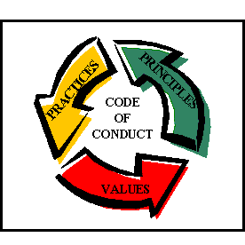

# Code of Conduct

Aiming to entrench a positive environment, we need to accept and adhere to some
behavioral guidelines, while committing and engaging in the project. Embracing
a collaborative - oriented conduct model, will bring us closer to the project's
scope by developing communication and cooperation skills. 

## NEED TO

```diff

+ Be reasonable when committing changes to the project
+ Be adaptive to the transforming environment
+ Be considerate and careful, emphasizing on your contribution's role and impact
+ Pave the way for a creative and mutually - respective community growth
+ Show empathy and care for other's effort
+ Meet the proposed formal requirements, by using unambiguous and inclusive language
+ Be open and make good use of criticism
+ Treat your colleagues as you want to be treated
+ Follow the practices and standards stated on README.md


```

## AVOID

```diff

- Pejorative and insulting language is undesirable
- Harassment of any kind MUST be excluded
- Ironic and sarcastic judgement is definitely unwanted
- Obscure and unclear statements lead to misconception, so stay away from them

```

<h1 align="center">
	

<h4 align="right">

[Image source](https://www.cbinigeria.com/why-your-organization-needs-to-write-a-code-of-conduct/)

</h4>

</h1>
