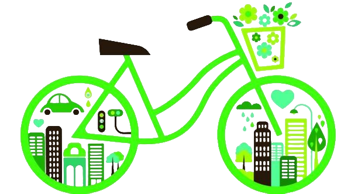
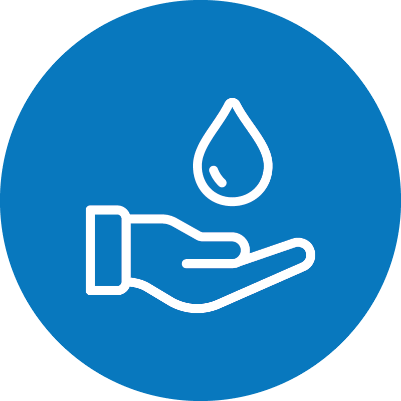
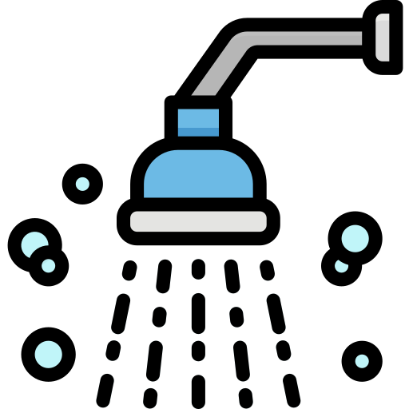

# Sustainable Living: Tips and Tricks for a Greener Lifestyle

## Getting started with sustainable & green living

Defining environmental sustainability in a clear and intelligible way, is of paramount importance, in order to approach this topic properly.
Following a green lifestyle, means to shape a way of life oriented to some earth-friendly key directions, stated below.

- Redefine your needs and develop lighter habits
- Protect natural resources by avoiding their overconsumption and safeguarding biodiversity
- Be actively aware of the current threats posed to environment (i.e. climate crisis components) and get eco-conscious
- Become more adaptive and open to eco-friendly practices

## There are many things you can do to live a greener lifestyle. Here are some ideas to get you started:

###  Reduce your energy consumption
One of the most effective ways to reduce your carbon footprint is to use less energy. You can do this by turning off lights and electronics when you're not using them, using energy-efficient appliances, and sealing air leaks in your home.
<h1 align="center">
	
<h4 align="right">

[Image source](https://icon-library.com/icon/energy-efficiency-icon-2.html)

</h4>
</h1>

### Use sustainable transportation
Instead of driving everywhere, consider walking, biking, or taking public transportation. This will not only reduce your carbon footprint but also improve your health.
<h1 align="center">
	
	
<h4 align="right">

[Image source](https://www.thecivilengineer.org/news/european-cities-lead-the-way-to-sustainable-transport)

</h4>
</h1>

### Reduce your water usage
You can conserve water by taking shorter showers, fixing leaky faucets, and watering your lawn and garden only when necessary.
<h1 align="center">
	
	<h4 align="right">

[Image source](https://www.ci.colton.ca.us/839/Water-Efficiency)

</h4>
</h1>

### Reduce your waste
Recycling is a great way to reduce waste, but it's even better to reduce the amount of waste you produce in the first place. Consider using reusable bags, containers, and water bottles, and composting your food scraps.
<h1 align="center">
	
	<h4 align="right">

[Image source](https://www.nicepng.com/ourpic/u2q8i1u2r5r5r5q8_recycling-symbol-icon-outline-dark-green-recycling-logo/)

</h4>
</h1>

### Eat a plant-based diet
Animal agriculture is a significant contributor to greenhouse gas emissions, so reducing your meat and dairy consumption can have a big impact on the environment. Try incorporating more plant-based meals into your diet.
<h1 align="center">
	
		<h4 align="right">

[Image source](https://www.dreamstime.com/vegan-logo-vegetarian-vector-icon-spoon-fork-leaf-graphic-design-element-vegan-logo-vegetarian-vector-icon-spoon-image157713288)

</h4>
</h1>

### Support eco-friendly businesses
When shopping, look for products and businesses that prioritize sustainability and eco-friendliness. This can include buying products made from recycled materials, choosing products with minimal packaging, and supporting local businesses.
<h1 align="center">
	
<h4 align="right">

[Image source](https://www.vecteezy.com/vector-art/5044617-eco-shopping-solid-green-vector-supermarket-cart-icon-with-leaves-image-isolated-on-white-background-organic-shopping-design-element-eco-shop-logo)

</h4>
</h1>

### Get involved in your community
Joining a local environmental organization or volunteering for environmental causes can help you make a positive impact on the environment and connect with others who share your values.
<h1 align="center">
	
	<h4 align="right">

[Image source](https://kidsaidcolorado.org/volunteer/)

</h4>
</h1>

### Reduce your washing
- ***Erin Rhoads’ Waste Not Every day*** (Hardie Grant Books, £10) points out that “the majority of the environmental burden caused by fashion happens after we take the clothing home: 82% of the energy a garment will use is in the washing and drying we do each week”. Rhoads suggests spot-cleaning, and neutralising smells with a spritz of diluted vodka or lemon juice.

<h1 align="center">
	
 
</h1>

### Clean with castile
- By making cleaning products (from polish to detergent) you can reduce the amount of plastic entering your home and the level of harmful VOCs (volatile organic compounds), such as formaldehyde, that are released. “Of all the green cleaning ingredients I use, liquid castile soap is by far my favourite,” writes Jen Chillingsworth in Clean Green (Quadrille, £7.55). “Originating from Spain, castile soap was traditionally made with pure olive oil, but is now more commonly produced by mixing vegetable oils such as hemp, avocado, jojoba and coconut.” For a simple, multipurpose kitchen spray, add 50ml of castile soap to 800ml tap water in a spray bottle. Add a few drops of essential oils (tea tree is antibacterial). Spray and wipe with a clean cloth.
Pile of clothes cut-out inside green-rimmed circle

<h1 align="center">
	
 
</h1>

### Go for plastic-free personal care
- There is a world of waste-free sanitary protection to explore, and Chillingsworth suggests buying a reusable tampon applicator. “The reusable version fits every size of tampon, is antimicrobial and easy to insert. After use, give it a wipe, rinse and return to the storage box that fits in your handbag. Sterilise in hot water between periods.”

<h1 align="center">
	
 
</h1>

### Recycle as much as you can
- “Most major supermarkets provide plastic recycling collection points in store for stretchy plastic (such as frozen food bags, carrier bags and bread bags) which normally can’t be recycled from home,” says Helen Bird, plastics expert at government waste advisory body Wrap.

- TerraCycle rescues hard-to-recycle waste that is not processed by councils. It has free national recycling programmes and also sells zero-waste boxes, which you can fill with most non-hazardous, non-recyclable and non-organic waste, and return for recycling. Search its website for a scheme near you, or set one up.

<h1 align="center">
	
 
</h1>

### Look after your electrical appliances
- The Restart Project is a social enterprise that aims to fix our relationship with electricals and electronics. Cofounder Janet Gunter says the first step in keeping household appliances for longer is regular cleaning. “By simply cleaning and maintaining your white goods, laptop or mobile, you will prolong its life.” Restart runs a nationwide network of skill-sharing workshops as well as promoting a directory of commercial repair options in London. (See also repaircafe.org for events in your area.) “If we don’t have access to spare parts,” says Gunter, “these appliances will be thrown away, which has a huge carbon impact.”

- If your electrical appliance really is beyond repair, **Rhoads** suggests you “call the manufacturer or company of purchase to see if they will take back items or packaging for reuse or recycling”. Not all charity shops accept electrical items, but the homelessness charity Emmaus accepts working items. These are tested before being resold, which makes it a good place to purchase secondhand electrical goods, too.
Houseplant cut-out inside green-rimmed circle

<h1 align="center">
	
 
</h1>

### Create clean air
- “You can never have enough houseplants,” says **Oliver Heath**, who runs a sustainable architecture practice. Certain plants are best for certain rooms: “Mother-in-law’s tongue gives off oxygen at night, which makes it best suited to the bedroom.” According to **Chillingsworth**, peace lilies and boston ferns thrive in rooms with high humidity and can reduce the mould spores in the air, making them ideal for bathrooms; weeping figs have been found to be the best plant for removing formaldehyde released from carpets and furniture, making them good for living areas.

<h1 align="center">
	
 
</h1>

### Change your shower head
- “Investing in an aerated shower head will make a significant difference to energy and water consumption,” says Brian Horne at the ***Energy Saving Trust (EST)***. They inject air into the water stream, limiting water usage. “A water-efficient shower head could save a four-person household £70 a year on gas for water heating, and a further £115 on water bills if they have a meter,” says Horne.

<h1 align="center">
	
 
</h1>

### Opt for green energy suppliers
- There are “shades of green” when it comes to choosing an energy supplier, says **Horne**. The ***EST*** identified four suppliers who clearly listed the renewable sources of their energy on their websites last year: Green Energy UK, Good Energy, Ecotricity and Octopus Energy. “But just because you’re on a green tariff, it doesn’t mean you should stop worrying about how much energy you use,” says Horne.

<h1 align="center">
	
 
</h1>

### Practise eco-driving
- Research by the **RAC Foundation** has found that eco-driving leads to safer, cleaner and more affordable journeys. Regular vehicle maintenance improves fuel efficiency by as much as 10%. Before a long journey, check tyre pressures (tyres underinflated by a quarter can cause a 2% increase in fuel consumption), remove unused roof racks and boxes, and don’t overload the car (every additional 45kg reduces fuel economy by 2%). At less than 40mph, it’s more fuel-efficient to open a window than use air conditioning. Turn off engines for waits of more than one minute (5-8% of fuel is consumed while idling), and avoid sharp acceleration and heavy braking: aggressive driving can significantly raise fuel consumption.

<h1 align="center">
	
 
</h1>

### Draught-proof your home
- One of the cheapest, most effective ways to save energy and money at home is to draught-proof windows, doors, letterbox, fireplaces and loft hatches, says **Dr Sarah Price**, head of building physics at ***Enhabit***, a consultancy specialising in low-energy design. Done professionally, it costs about £200, or do it yourself with products such as Gap Seal.
Furniture cut-out inside green-rimmed circle

<h1 align="center">
	
 
</h1>

### Buy vintage furniture
>“Reusing furniture is the best thing to do, and so much more fun than buying new,”

says **Nicola Harding**, founder of interior design studio Harding and Read. “Secondhand items come with interesting stories and force you to think creatively, and give you have something far more unique.” To keep mileage down, start at your local auction houses and charity shops (the British Heart Foundation has dedicated home stores and a free collection service), followed by a targeted trawl through Freecycle and Facebook Marketplace.

<h1 align="center">
	
 
</h1>

### Optimise your white goods
- According to independent energy comparison service **U Switch**, the cost of running your fridge and freezer equates to about 7% of your total energy bill (they are one of the few household energy devices that are on all the time). **U Switch** recommends replacing your fridge and/or freezer if it is over 10 years old. Even if it’s working, the cost of a new model will be made up for in energy savings over the years. Keep your fridge at 5C or less (most are kept at about 7C, which means food will go off sooner) and ensure there is a 10cm gap behind your fridge to let heat flow away easily. Make sure the seal is strong – if it can’t hold a piece of paper when shut, it could be letting in warm air, making it work harder.

<h1 align="center">
	
 
</h1>

## Understanding the value of a sustainable lifestyle

Applying and including the above practices to your everyday life, will certainly be beneficial and valuable for both sides. To be more specific, we present you some demonstrative rewarding cases.

- Restrict your negative environmental impact
    - reduce your carbon footprint

- Lessen your daily expenses, that being:
    - green energy is cost-effective and keeps your electricity bills at low levels
    - eco-friendly products are gradually becoming more affordable

- Pave the way for a healthier life
    - a vegetarian-oriented nutrition is a lifesaver for addressing potential health issues

- Share and spread your green lifestyle profile
    - inspire and bring more people closer to the sustainable living model
    - don't forget that it's all about collaboration and contribution when we need game-changing results
    - make the first step for the desired domino effect

## Citations

1. Gendre, I. (2023, February 28). What is green living? Greenly. Retrieved March 23, 2023, from https://greenly.earth/en-us/blog/company-guide/what-is-green-living 
2. [The Guardian](https://www.theguardian.com/environment/2020/feb/29/50-ways-to-green-up-your-life-save-the-planet) 