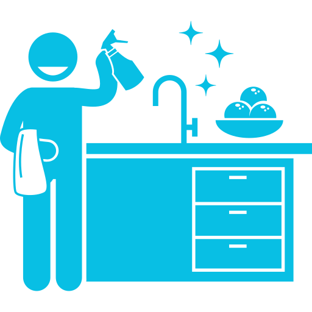
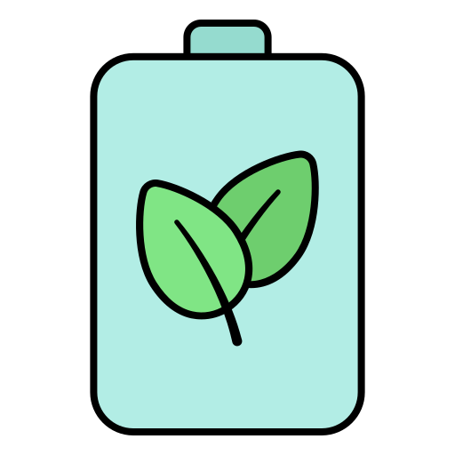

# Sustainable Living: Tips and Tricks for a Greener Lifestyle

## Table of Contents

- [Sustainable Living: Tips and Tricks for a Greener Lifestyle](#sustainable-living-tips-and-tricks-for-a-greener-lifestyle)
  - [Table of Contents](#table-of-contents)
  - [What is Sustainable Living?](#what-is-sustainable-living)
  - [What is NOT Sustainable Living?](#what-is-not-sustainable-living)
  - [Getting started with sustainable \& green living](#getting-started-with-sustainable--green-living)
  - [7 principles of sustainable living](#7-principles-of-sustainable-living)
  - [There are many things you can do to live a greener lifestyle. Here are some ideas to get you started:](#there-are-many-things-you-can-do-to-live-a-greener-lifestyle-here-are-some-ideas-to-get-you-started)
    - [Reduce your energy consumption](#reduce-your-energy-consumption)
    - [Use sustainable transportation](#use-sustainable-transportation)
    - [Reduce your water usage](#reduce-your-water-usage)
    - [Reduce your waste](#reduce-your-waste)
    - [Eat a plant-based diet](#eat-a-plant-based-diet)
    - [Support eco-friendly businesses](#support-eco-friendly-businesses)
    - [Get involved in your community](#get-involved-in-your-community)
    - [Reduce your washing](#reduce-your-washing)
    - [Clean with castile](#clean-with-castile)
    - [Go for plastic-free personal care](#go-for-plastic-free-personal-care)
    - [Recycle as much as you can](#recycle-as-much-as-you-can)
    - [Look after your electrical appliances](#look-after-your-electrical-appliances)
    - [Create clean air](#create-clean-air)
    - [Change your shower head](#change-your-shower-head)
    - [Use a cup while brushing your teeth](#use-a-cup-while-brushing-your-teeth)
    - [Opt for green energy suppliers](#opt-for-green-energy-suppliers)
    - [Practise eco-driving](#practise-eco-driving)
    - [Draught-proof your home](#draught-proof-your-home)
    - [Buy vintage furniture](#buy-vintage-furniture)
    - [Optimise your white goods](#optimise-your-white-goods)
    - [Go smart](#go-smart)
    - [Insulate, Insulate, Insulate](#insulate-insulate-insulate)
    - [Use your own cup](#use-your-own-cup)
    - [Invest in renewable energy solutions](#invest-in-renewable-energy-solutions)
    - [Use LED Lights](#use-led-lights)
    - [Recycle And Recharge Batteries](#recycle-and-recharge-batteries)
    - [Practice mindful consumption by only buying what you need and repairing instead of replacing broken items](#practice-mindful-consumption-by-only-buying-what-you-need-and-repairing-instead-of-replacing-broken-items)
  - [Understanding the value of a sustainable lifestyle](#understanding-the-value-of-a-sustainable-lifestyle)
  - [Apps you can use to help you live sustainably](#apps-you-can-use-to-help-you-live-sustainably)
  - [Green Communities](#green-communities)
  - [Testimonials](#testimonials)
  - [European Union's (EU) 2030 Agenda for Sustainable Development](#european-unions-eu-2030-agenda-for-sustainable-development)
  - [Citations](#citations)
  - [Interesting videos](#interesting-videos)
  - [Interesting podcasts](#interesting-podcasts)
  - [Current Contributors](#current-contributors)

---

## What is Sustainable Living?

**Make the right decisions today, save the planet of tomorrow!**

The term Sustainable Living is used to express a lifestyle choice of reducing the carbon footprint and generally the use
of the Earth’s natural resources either as individuals or society.

The aim of Sustainable Living is to minimize as possible the harm inevitably caused to our planet by our own actions. In
our modern world of fast living and over consuming, we may not understand how important it is not only for us, but also
for the generations to come to protect and care after our environment. Climate change, rising sea levels, extreme
weather conditions and ozone layer thinning are all human induced problems that could result in our planet being doomed.

Despite the benefits of Sustainable Living to our environment, individuals that choose to live by that philosophy can
improve their well-being, both psychologically and physically. Generally, the quality of a person’s life is directly
affected by their habits and the way they choose to live. For example, Sustainable living can urge people to adopt
healthier habits and decrease their dependence on artificial machines by altering them in more eco-friendly options.

**In that way Sustainable Living makes you use less, want less, need less.**

## What is NOT Sustainable Living?

To be clear about sustainability lets define un-sustainability as well with an example, shall we? So lets imagine you
wake up an in world where 100000000 (finite number) apples are laying down in the ground, that don't go bad - for ever.
" Woooooooooooooow I have food forever" you think.
So you eat apples every day. But instead of eating one a day, you say:
" I have these many apples, why eat just one? Right people?"
And all your friends in your community agreed. So everyone started eating 10 apples a day (imaginary world okay?) and at
some point 100 and then 1000 and then 10000...
In the meantime, in your community people were having children that were getting used to having the privilege of eating
as many apples as they wanted.
However, as the number of apples is finite, the children got anxious and nervous at their parents for being so wasteful
and greedy with the apples, thinking they own them... So they started protesting but their parents didn't care. And they
kept eating and eating till 5 apples were left in the world. So no more apples for the children's generation.

## Getting started with sustainable & green living

Defining environmental sustainability in a clear and intelligible way, is of paramount importance, in order to approach
this topic properly.
Following a green lifestyle, means to shape a way of life oriented to some earth-friendly key directions, stated below.

- Redefine your needs and develop lighter habits
- Protect natural resources by avoiding their overconsumption and safeguarding biodiversity
- Be actively aware of the current threats posed to environment (i.e. climate crisis components) and get eco-conscious
- Become more adaptive and open to eco-friendly practices

## 7 principles of sustainable living
---
**1. Effective land use and wildlife protection**

Effective land use and wildlife protection are two crucial components of sustainable development. Land use refers to the management of land resources in a way that optimizes economic, social, and environmental benefits while minimizing negative impacts. On the other hand, wildlife protection involves the conservation and management of wild animals and their habitats to ensure their survival.

Effective land use and wildlife protection are closely interconnected since land use decisions can have a significant impact on wildlife and their habitats. For instance, unsustainable land use practices such as deforestation, land conversion for agriculture or urbanization, and infrastructure development can lead to habitat loss, fragmentation, and degradation, which threaten the survival of many species.

Therefore, it is essential to adopt land use practices that minimize negative impacts on wildlife and their habitats while promoting sustainable economic development. This can be achieved through various approaches such as land-use planning, zoning, protected area management, and wildlife conservation strategies that consider the needs of both people and wildlife.

---

**2. Sustainable water usage**

Sustainable water usage is the responsible and efficient management of water resources to meet the needs of the present without compromising the ability of future generations to meet their own needs. Sustainable water usage is essential because water is a finite resource, and its availability is increasingly under pressure due to population growth, climate change, and unsustainable water use practices.

Sustainable water usage involves managing water demand through conservation and efficiency measures, reducing water losses through leakage prevention, and enhancing the quality of water resources through pollution control and wastewater treatment. It also involves promoting the use of alternative water sources such as rainwater harvesting, groundwater recharge, and recycled wastewater.

Effective management of sustainable water usage requires the involvement of all stakeholders, including water users, water managers, policymakers, and communities. It requires the adoption of integrated water resource management approaches that take into account the water needs of different sectors, such as agriculture, industry, and households, as well as the ecological requirements of water-dependent ecosystems.

Sustainable water usage is critical for ensuring water security and resilience, protecting human health, and promoting economic development. It also helps to mitigate the impacts of climate change by reducing water-related risks such as floods, droughts, and water scarcity. By adopting sustainable water usage practices, we can ensure the availability of water resources for future generations while maintaining the ecological integrity of our planet.

---
**3. Supporting local and organic foods**

Supporting local and organic foods is a sustainable food production and consumption practice that promotes the consumption of locally grown, seasonal, and organic food. This approach aims to reduce the environmental impact of food production, support local economies, and improve the health and well-being of consumers.

Local food refers to food produced within a certain geographical area, usually within 100 miles of the place of consumption. By supporting local food, consumers reduce the carbon footprint of food transportation, support local farmers and food producers, and promote food security and resilience.

Organic food, on the other hand, refers to food produced without the use of synthetic pesticides, fertilizers, and genetically modified organisms (GMOs). Organic farming practices prioritize the use of renewable resources and the conservation of biodiversity, soil fertility, and water quality.

Supporting local and organic foods also promotes healthier and more nutritious diets, as these foods tend to be fresher, more diverse, and less processed. In addition, local and organic foods are often produced using more sustainable farming methods, which help to reduce environmental impacts such as soil erosion, water pollution, and loss of biodiversity.

By supporting local and organic foods, consumers can help to create a more sustainable food system that supports local economies, protects the environment, and promotes healthy and nutritious diets. This can be done by purchasing local and organic foods from farmers markets, community-supported agriculture (CSA) programs, and other local food initiatives.

---
**4. The use of sustainable materials**

The use of sustainable materials refers to the practice of using materials that are environmentally responsible and have a minimal impact on the planet's natural resources. The goal is to reduce waste, conserve energy and resources, and minimize harm to the environment.

Sustainable materials can come from a variety of sources, including renewable resources like wood, bamboo, and cotton, as well as recycled materials such as plastics, metals, and glass. These materials are often used in products that promote environmental sustainability, such as eco-friendly clothing, packaging, building materials, and furniture.

In addition to their environmental benefits, sustainable materials can also provide economic benefits. For example, using recycled materials can reduce production costs, while using renewable resources can create jobs and support local economies.

Overall, the use of sustainable materials is an important practice for reducing our impact on the environment and promoting a more sustainable future. By choosing products made from sustainable materials, we can help to reduce waste, conserve resources, and protect the planet for future generations.

---
**5. The use of sustainable transport**

The use of sustainable transport refers to the practice of using modes of transportation that have a lower impact on the environment and contribute to a more sustainable future. The most common forms of sustainable transport are walking, cycling, and public transportation.

Walking and cycling are both sustainable modes of transport as they are powered by human energy and emit no pollution. They also promote physical activity and can contribute to better health outcomes. However, they may not be practical for long distances or in areas with challenging terrain.

Public transportation, such as buses and trains, is another form of sustainable transport. Public transportation systems are typically powered by electricity or other low-emission fuels and are able to move large numbers of people at once, reducing the number of individual cars on the road. This can help to reduce traffic congestion and air pollution.

Other forms of sustainable transport include electric vehicles (EVs) and car-sharing services. EVs are powered by electricity and emit no tailpipe emissions, making them a cleaner alternative to traditional gasoline-powered vehicles. Car-sharing services allow multiple individuals to use a single vehicle, reducing the number of cars on the road and the associated environmental impact.

Overall, the use of sustainable transport is an important practice for reducing our impact on the environment and promoting a more sustainable future. By choosing sustainable modes of transportation, we can help to reduce greenhouse gas emissions, improve air quality, and reduce our reliance on fossil fuels.

---
**6. Zero waste and zero carbon**

Zero waste and zero carbon are two concepts that are closely related and are both aimed at reducing our impact on the environment.

Zero waste refers to the practice of reducing, reusing, and recycling waste in order to divert it from landfills and minimize our impact on the environment. The goal is to create a closed loop system in which resources are kept in use for as long as possible, with the minimum amount of waste generated. This includes practices such as composting, recycling, and reducing single-use plastics and packaging. By implementing zero waste practices, we can help to reduce the amount of waste we produce and conserve natural resources.

Zero carbon, on the other hand, refers to the goal of achieving net-zero carbon emissions. This means that any carbon emissions produced are offset by carbon sequestration or other measures. The primary sources of carbon emissions are from the burning of fossil fuels for transportation, heating, and electricity. Achieving zero carbon requires transitioning to renewable energy sources such as wind and solar power, as well as improving energy efficiency and reducing overall energy consumption.

Both zero waste and zero carbon are important concepts for promoting sustainability and reducing our impact on the environment. By reducing waste and carbon emissions, we can help to protect the planet for future generations and create a more sustainable future.

---
**7. Creating own healthy environment**

Creating your own healthy environment involves taking steps to reduce exposure to harmful substances and promote a safe and healthy living space. Here are some tips for creating a healthy environment:

><b>Improve air quality</b>: Air pollution can negatively impact health, so it's important to take steps to improve indoor air quality. This can include using air filters, opening windows for ventilation, and avoiding the use of harsh chemicals and cleaners.

><b>Reduce exposure to toxins</b>: Toxins such as lead, asbestos, and radon can be found in some homes and can be harmful to health. Take steps to identify and remove any sources of toxins in your home.

><b>Use non-toxic products</b>: Choose non-toxic products for cleaning, personal care, and household items. This can help reduce exposure to harmful chemicals.

><b>Promote natural light</b>: Natural light is important for both physical and mental health. Ensure that your home has plenty of natural light and consider using light therapy if necessary.

><b>Create a calm and relaxing environment</b>: A calm and relaxing environment can promote mental health and well-being. This can be achieved by using calming colors, minimizing clutter, and incorporating natural elements such as plants and nature sounds.

---

## There are many things you can do to live a greener lifestyle. Here are some ideas to get you started:

### Reduce your energy consumption

One of the most effective ways to reduce your carbon footprint is to use less energy. You can do this by turning off
lights and electronics when you're not using them, using energy-efficient appliances, and sealing air leaks in your
home.
<h1 align="center">
	
<h4 align="right">

[Image source](https://icon-library.com/icon/energy-efficiency-icon-2.html)

</h4>
</h1>

### Use sustainable transportation

Instead of driving everywhere, consider walking, biking, or taking public transportation. This will not only reduce your
carbon footprint but also improve your health.
<h1 align="center">
	

<h4 align="right">

[Image source](https://www.thecivilengineer.org/news/european-cities-lead-the-way-to-sustainable-transport)

</h4>
</h1>

### Reduce your water usage

You can conserve water by taking shorter showers, fixing leaky faucets, and watering your lawn and garden only when
necessary.
<h1 align="center">
	
	<h4 align="right">

[Image source](https://www.ci.colton.ca.us/839/Water-Efficiency)

</h4>
</h1>

### Reduce your waste

Recycling is a great way to reduce waste, but it's even better to reduce the amount of waste you produce in the first
place. Consider using reusable bags, containers, and water bottles, and composting your food scraps.
<h1 align="center">
	
	<h4 align="right">

[Image source](https://www.thantmyanmar.com/en/engagement/reduce-plastic-waste-in-organizations)

</h4>
</h1>

### Eat a plant-based diet

Animal agriculture is a significant contributor to greenhouse gas emissions, so reducing your meat and dairy consumption
can have a big impact on the environment. Try incorporating more plant-based meals into your diet.
<h1 align="center">
	
		<h4 align="right">

[Image source](https://www.dreamstime.com/vegan-logo-vegetarian-vector-icon-spoon-fork-leaf-graphic-design-element-vegan-logo-vegetarian-vector-icon-spoon-image157713288)

</h4>
</h1>

### Support eco-friendly businesses

When shopping, look for products and businesses that prioritize sustainability and eco-friendliness. This can include
buying products made from recycled materials, choosing products with minimal packaging, and supporting local businesses.
<h1 align="center">
	
<h4 align="right">

[Image source](https://www.vecteezy.com/vector-art/5044617-eco-shopping-solid-green-vector-supermarket-cart-icon-with-leaves-image-isolated-on-white-background-organic-shopping-design-element-eco-shop-logo)

</h4>
</h1>

### Get involved in your community

Joining a local environmental organization or volunteering for environmental causes can help you make a positive impact
on the environment and connect with others who share your values.
<h1 align="center">
	
	<h4 align="right">

[Image source](https://kidsaidcolorado.org/volunteer/)

</h4>
</h1>

### Reduce your washing

- ***"Waste Not Every day" by Erin Rhoads***, published by **Hardie Grant Books** and priced at £10, the biggest impact
  on the
  environment caused by fashion occurs after we bring clothing home. In fact, 82% of the energy a garment consumes is a
  result of the washing and drying we do every week. **Rhoads** proposes alternatives to traditional washing, such as
  spot-cleaning and using diluted vodka or lemon juice to eliminate odors.2

<h1 align="center">
	

<h4 align="right">

[Image source](https://www.flaticon.com/free-icon/washing-machine_3003984?term=washing+machine&page=1&position=4&origin=tag&related_id=3003984)

</h4>

</h1>

### Clean with castile

- In "Clean Green" by **Jen Chillingsworth**, published by **Quadrille** and priced at £7.55, it is suggested that
  making your
  own cleaning products, such as polish and detergent, can decrease the amount of plastic entering your home and
  minimize the release of harmful VOCs, including formaldehyde. **Chillingsworth** highly recommends liquid castile
  soap,
  which was traditionally made with pure olive oil from Spain, but is now commonly produced by blending vegetable oils
  like hemp, avocado, jojoba, and coconut. For a straightforward and versatile kitchen spray, combine 50ml of castile
  soap with 800ml of tap water in a spray bottle, and add a few drops of essential oils, such as tea tree oil, which has
  antibacterial properties. Finally, spray the solution and wipe it down with a clean cloth.2

<h1 align="center">
	

<h4 align="right">

[Image source](rigin=search&related_id=10052271)

</h4>
</h1>

### Go for plastic-free personal care

- According to **Chillingsworth**, there are numerous options to explore when it comes to waste-free sanitary
  protection,
  and she recommends purchasing a reusable tampon applicator. This applicator is reusable, fits any size of tampon, and
  is antimicrobial and simple to insert. Once used, it can be wiped, rinsed, and returned to its storage box, which
  conveniently fits in a purse. It should be sterilized in hot water between periods for hygiene purposes.2

<h1 align="center">
	

<h4 align="right">

[Image source](https://www.flaticon.com/free-icon/plastic-free_6588996?term=plastic-free&page=1&position=56&origin=search&related_id=6588996)

</h4>

</h1>

### Recycle as much as you can

- **Helen Bird**, a plastics expert at Wrap, a government waste advisory organization, states that many major
  supermarkets
  offer in-store collection points for stretchy plastics such as carrier bags, bread bags, and frozen food bags, which
  cannot typically be recycled at home.2

- **TerraCycle** is a company that specializes in rescuing waste that is difficult to recycle and is not handled by
  local
  councils. They offer national recycling programs free of charge, as well as sell zero-waste boxes that allow you to
  gather and return most non-organic, non-recyclable, and non-hazardous waste for recycling purposes. You can visit
  their website to locate a program in your area or establish your own.2

<h1 align="center">
	

<h4 align="right">

[Image source](https://www.flaticon.com/free-icon/recycle-symbol_1327264?term=recycle&page=1&position=1&origin=search&related_id=1327264)

</h4>

</h1>

### Look after your electrical appliances

- The Restart Project is a social enterprise that strives to improve our relationship with electronics and electrical
  items. According to cofounder **Janet Gunter**, the initial step to extend the lifespan of household appliances is to
  regularly clean and maintain them. By doing so, white goods, laptops, and mobile devices can last longer. Restart
  operates a nationwide network of skill-sharing workshops and promotes a commercial repair directory in London. To find
  similar events in your area, visit [repaircafe.org](https://www.repaircafe.org/en/). Gunter stresses that if spare
  parts are not accessible, these
  appliances may be discarded, resulting in a significant carbon impact.2

- If your electrical appliance is truly irreparable, **Rhoads** recommends contacting the manufacturer or the company
  from
  which you made the purchase to inquire if they would take back the item or its packaging for reuse or recycling. While
  not all charity shops accept electrical items, the homelessness charity Emmaus welcomes working items that are tested
  before being resold, making it a great place to purchase secondhand electrical goods as well.2

<h1 align="center">
	

<h4 align="right">

[Image source](https://www.flaticon.com/free-icon/wrench_2092041?term=repair&page=1&position=3&origin=search&related_id=2092041)

</h4>

</h1>

### Create clean air

- **Oliver Heath**, who operates a sustainable architecture practice, claims that "you can never have enough
  houseplants."
  He suggests specific plants for particular rooms, stating that "mother-in-law's tongue is ideal for the bedroom since
  it emits oxygen at night." Meanwhile, **Chillingsworth** claims that peace lilies and Boston ferns flourish in
  high-humidity environments and can decrease the concentration of mould spores in the air, making them suitable for
  bathrooms. Weeping figs are the best option for removing formaldehyde released by furniture and carpets, making them a
  suitable choice for living areas.2

<h1 align="center">
	

<h4 align="right">

[Image source](https://www.flaticon.com/free-icon/plants_1703178?term=plant&page=1&position=16&origin=search&related_id=1703178)

</h4>

</h1>

### Change your shower head

- According to Brian Horne from the ***Energy Saving Trust (EST)***, "investing in an aerated shower head can have a
  significant impact on water and energy consumption." These shower heads incorporate air into the water flow, thereby
  reducing water usage. Horne explains that "a water-efficient shower head could save a four-person household £70 per
  year on gas for water heating, as well as an additional £115 on water bills if they use a meter."2

<h1 align="center">
	

<h4 align="right">

[Image source](https://www.flaticon.com/free-icon/shower_1752086?term=shower+head&page=1&position=5&origin=search&related_id=1752086)

</h4>

</h1>

### Use a cup while brushing your teeth

- According to <b>glencanyon.org</b> , not using a cup while brushing your teeth can result in spending extra 2-3 gallons of water every day. Make sure to have a cup while while brushing your teeth, and fill it with as much water as you will need. 5

<h1 align="center">
        

<h4 align="right">

[Image source](https://www.flaticon.com/free-icon/toothbrush_614651?term=toothbrush&page=1&position=6&origin=search&related_id=614651)

</h4>

</h1>

### Opt for green energy suppliers

- According to **Horne**, there are different levels of environmental friendliness to consider when selecting an energy
  provider. Last year, the EST recognized four suppliers, including Green Energy UK, Good Energy, Ecotricity, and
  Octopus Energy, who openly disclosed the renewable sources of their energy on their websites. Nevertheless, Horne
  cautions that even if you opt for a green energy plan, it does not mean that you can neglect energy conservation
  efforts.2

<h1 align="center">
	

<h4 align="right">

[Image source](https://www.flaticon.com/free-icon/green-energy_2990815?term=green+energy&page=1&position=7&origin=search&related_id=2990815)

</h4>

</h1>

### Practise eco-driving

- The **RAC Foundation's** research indicates that eco-driving practices result in journeys that are safer, less
  polluting,
  and more economical. By upkeeping vehicles, fuel efficiency can improve by up to 10%. Prior to embarking on a long
  trip, it is recommended to verify that tire pressures are adequate (underinflated tires by a quarter can result in a
  2% increase in fuel consumption), remove unnecessary roof racks and boxes, and avoid overloading the car (as every
  additional 45kg decreases fuel economy by 2%). When driving at less than 40mph, it is more energy-efficient to open a
  window rather than using air conditioning. It is advised to switch off engines if they are idle for more than a
  minute (since 5-8% of fuel is consumed while idling), and avoid sudden acceleration and heavy braking as it can
  significantly increase fuel consumption.2

<h1 align="center">
	

<h4 align="right">

[Image source](https://www.flaticon.com/free-icon/eco-friendly_8724870?term=eco-driving&page=1&position=8&origin=search&related_id=8724870)

</h4>

</h1>

### Draught-proof your home

- According to **Dr Sarah Price**, who heads building physics at ***Enhabit***, a consultancy that specializes in
  low-energy
  design, draught-proofing windows, doors, letterboxes, fireplaces, and loft hatches is one of the most affordable and
  effective ways to save money and energy at home. It can be done professionally for approximately £200, or using
  products such as Gap Seal, as a DIY project.2

- Another easy way is to double-glaze your windows as non double-glazed windows can be the reason for a home to lose up
  to 30% of its heating or cooling.3 You can also combine the windows with curtains with heavy liners, to
  close them when the sun sets not to lose any extra heat.

<h1 align="center">
	

<h4 align="right">

[Image source](https://www.flaticon.com/free-icon/window_2197440?term=windows&page=1&position=9&origin=search&related_id=2197440)

</h4>

</h1>

### Buy vintage furniture

- Founder of interior design studio Harding and Read, **Nicola Harding**, suggests that reusing furniture is not only
  the best
  thing to do, but it is also more enjoyable than buying new. Secondhand items come with interesting stories and prompt
  creative thinking, resulting in something unique. To minimize transportation distance, Harding suggests starting with
  local auction houses and charity shops, such as the ***British Heart Foundation***, which offers dedicated home stores
  and a
  free collection service. After that, a focused search can be conducted on platforms such as Freecycle and Facebook
  Marketplace.2

<h1 align="center">
	

<h4 align="right">

[Image source](https://www.flaticon.com/free-icon/clock_1171793?term=vintage+furniture&page=1&position=1&origin=search&related_id=1171793)

</h4>

</h1>

### Optimise your white goods

- **U Switch**, an independent energy comparison service, suggests that the cost of running your fridge and freezer
  makes up
  approximately 7% of your total energy bill, as they are among the few household devices that are constantly on. To
  save energy, **U Switch** recommends replacing your fridge and/or freezer if it is over a decade old, even if it is
  still
  functioning. The cost of a new model will be offset by energy savings over time. Additionally, it is important to
  maintain your fridge's temperature at 5°C or below (most are kept at around 7°C, which causes food to spoil sooner),
  and ensure there is a 10cm gap behind it to allow heat to escape. Finally, check that the seal is strong, as if it
  cannot hold a piece of paper when closed, it may be allowing warm air to enter, forcing it to work harder.2

<h1 align="center">
	
<h4 align="right">

[Image source](https://www.flaticon.com/free-icon/development_2629663?term=optimize&page=1&position=27&origin=search&related_id=2629663)

</h4>

</h1>

### Go smart

- Try having smart home gadgets,
  like [programmable thermostat](https://www.energy.gov/energysaver/programmable-thermostats), leds or smart switches.
  This way you can control exactly when you use anything in your home and monitor how much do you use it.

<h1 align="center">
	
</h1>
<h4 align=right>

[Image source](https://www.flaticon.com/free-icon/ecology-364_10142464?term=eco&page=1&position=33&origin=search&related_id=10142464)

</h4>

### Insulate, Insulate, Insulate

- Your house isn't always that good at keeping in the heat. So try insulating around heat sources
  like [radiators](https://www.doityourself.com/stry/installing-reflective-insulation-behind-radiators), or places that
  are not usually insulating, like the attic.
- Chimney balloons are also another way of insulating your home, of course, if you have a chimney.

<h1 align="center">
	
</h1>
<h4 align=right>

[Image source](https://www.flaticon.com/free-icon/house_3638003?term=insulate&page=1&position=2&origin=search&related_id=3638003)

</h4>

### Use your own cup

- According to
  the [Guardian](https://www.theguardian.com/environment/2020/apr/26/why-britains-25-billion-paper-coffee-cups-are-an-eco-disaster),
  in the UK alone 2.5 billion paper cups were used, most of which were used only once. On average, a paper cup requires
  0.58 liters of water to be produced, and leaves a carbon footprint of 60.9 grams of carbon dioxide. By using your cup
  when buying a coffee, you can reduce the amount of waste produced by single-use cups, protect the environment and even
  spend less money long-term.

<h1 align="center">
	

<h4 align="right">

[Image source](https://www.flaticon.com/free-icon/paper-cup-of-coffee_66766?term=cup+of+coffee&page=1&position=60&origin=search&related_id=66766)

</h4>

</h1>

### Invest in renewable energy solutions

- Investing in renewable energy solutions, such as solar panels or wind turbines, can have a significant impact on
  reducing carbon emissions and mitigating the effects of climate change.

- Renewable energy is becoming increasingly accessible and affordable, and many governments offer incentives and tax
  credits for homeowners and businesses to invest in these technologies.

- By generating your own renewable energy, you can reduce your reliance on fossil fuels, save money on energy bills, and
  even generate income by selling surplus energy back to the grid.

<h1 align="center"> 
	 

<h4 align="right"> 

[Image source](https://cdn-icons-png.flaticon.com/512/3520/3520305.png)

</h4> 

</h1>

### Use LED Lights

- Sam Allcock, in his
  article [Sustainable Living: 5 Ways To Do Your Part for The Planet](https://wealthofgeeks.com/sustainable-living-5-ways-to-do-your-part-for-the-planet/)
  states that a good way to reduce your energy use and carbon footprint is replacing traditional bulbs with Light
  Emitting Diodes (LED) lights.

- LED lights have an exceptionally longer life span, while also consuming less energy. Also, unlike traditional bulbs,
  LED lights do not contain harmful materials and gasses, such as mercury. That way, you can save money of your
  electrical bill while also protecting yourself and the environment.

### Recycle And Recharge Batteries

- Don't throw away used batteries in regular trash or choose rechargeable batteries. Most types of regular batteries
  contain materials and components very harmful both for people and the environment. They can be the cause to fires, or
  even explosions, and the pollution of soil.

- Here are some ways to recycle or safely discard conventional batteries, as stated by
  the [United States Environmental Protection Agency](https://www.epa.gov/recycle/used-household-batteries):
    1. To prevent fires from lithium-ion batteries, tape battery terminals and/or place batteries in separate plastic
       bags and never put these batteries in household garbage or recycling bins.
    2. Choose the right recycling spot closer to you. [Earth911]( https://search.earth911.com/?what=Batteries) is a
       useful site for finding the right disposal spot.
    3. Send your used batteries in mail-in recycle programs, such as [Call2Recycle](https://www.call2recycle.org/).

<h1 align="center"> 
	 

<h4 align="right"> 

[Image source](https://www.flaticon.com/free-icon/battery_10158226?term=battery&page=1&position=32&origin=search&related_id=10158226)

</h4> 

</h1>

### Practice mindful consumption by only buying what you need and repairing instead of replacing broken items
It involves considering the environmental impact, social implications, and personal needs before making a purchase.

One business that encourages this movement is "Patagonia" which is a well-known outdoor apparel brand that is committed to reducing its environmental impact and promoting fair labor practises.

We can adopt this mentality from books such as "The life-Changing Magic of Tidying Up" and "Cradle to Cradle".

By being intentional about the things we buy and consume, we can reduce our environmental impact and promote social justice.

<h1 align="center"> 
	 

<h4 align="right"> 

[Image source](https://www.flaticon.com/free-icon/consumption_4816164?term=mindful+consumption&page=1&position=1&origin=search&related_id=4816164ed_id=10158226)

</h4> 

</h1>

## Understanding the value of a sustainable lifestyle

Applying and including the above practices to your everyday life, will certainly be beneficial and valuable for both
sides. To be more specific, we present you some demonstrative rewarding cases.

- Restrict your negative environmental impact
    - reduce your carbon footprint
    - protect the planet's natural resources

- Lessen your daily expenses, that being:
    - green energy is cost-effective and keeps your electricity bills at low levels
    - eco-friendly products are gradually becoming more affordable

- Pave the way for a healthier life
    - a vegetarian-oriented nutrition is a lifesaver for addressing potential health issues leading to improved overall
      health and well-being

- Share and spread your green lifestyle profile
    - inspire and bring more people closer to the sustainable living model
    - don't forget that it's all about collaboration and contribution when we need game-changing results
    - make the first step for the desired domino effect

- Support local communities
    - create a more resilient and equitable economy

---

## Apps you can use to help you live sustainably

---
 

<!-- ECOSIA -->

<h3 style="font-size:20px" align="center">Ecosia</h3>

 
	 

 

[Image source](https://play-lh.googleusercontent.com/_nuyeEgn6In53vmNpgZkj2nVyR26CPZe3QxKOIk1jWVqwkt4WGWo6m4k4CGNS_3C7Og=s48-rw)

 

 

Get Ecosia’s browser to start planting trees with your searches. Ecosia is a search engine that makes money through ads, but uses 100% of the profits for the planet. The Ecosia community has already planted 150 million trees in over 35 countries.

Get it on: [Google Play](https://play.google.com/store/apps/details?id=com.ecosia.android&hl=en&gl=US), [App Store](https://apps.apple.com/us/app/ecosia/id670881887)

 

  

 

---
 

<!-- GECO AIR -->

<h3 style="font-size:20px" align="center">Geco air</h3>
 

 
 

 

[Image source](https://play-lh.googleusercontent.com/bdcArYWzNKkmbUnNl1HS2egdggpNOazIAJhve_atbD2_dLEbkAidVz39EsMgHZV4DecH=w240-h480-rw)

 
 
Geco air is your mobility companion that allows you to reduce the pollution linked to your displacements. Benefit from personalized advice to improve your driving style or mobility habits.

Get it on: [Google Play](https://play.google.com/store/apps/details?id=com.ifpen.gecoair&hl=en&gl=US), [App Store](https://apps.apple.com/us/app/geco-air-air-quality/id1169064121)

---
 

<!-- JOULEBUG -->

<h3 style="font-size:20px" align="center">JouleBug</h3>
 

 
	 

 

[Image source](https://www.educationalappstore.com/images/upload/10750-logo-joulebug.jpg)

 
 
JouleBug aims to encourage sustainable behaviors in your daily routine by making them easy and enjoyable, rather than tedious or challenging. 

Get it on: [Google Play](https://play.google.com/store/apps/details?id=com.cleanbit.joulebug&gl=US&pli=1), [App Store](https://apps.apple.com/us/app/joulebug/id391199306)

---
 

<!-- OLIO -->

<h3 style="font-size:20px" align="center">Olio</h3>
 

 
	 

 

[Image source](https://upload.wikimedia.org/wikipedia/commons/thumb/e/e7/Olio_new_logo.png/220px-Olio_new_logo.png)

 

Olio is a food-sharing app that allows you to connect with neighbors and local businesses to share excess food that might otherwise go to waste.

Get it on: [Google Play](https://play.google.com/store/apps/details?id=com.olioex.android&hl=en&gl=US), [App Store](https://apps.apple.com/gb/app/olio/id1008237086)

---
 

<!-- TOO GOOD TO GO -->

<h3 style="font-size:20px" align="center">Too Good To Go</h3>
 

 
	 

 

[Image source](https://seeklogo.com/images/T/too-good-to-go-logo-D34C48CD2D-seeklogo.com.png)

 

 

Too Good To Go is a mobile app that helps reduce food waste by connecting users with local restaurants and stores that
have surplus food. Users can purchase food at a discounted price through the app, and the food is rescued from being
thrown away.

Get it
on: [Google Play](https://play.google.com/store/apps/details?id=com.app.tgtg&gl=US), [App Store](https://apps.apple.com/us/app/too-good-to-go-end-food-waste/id1060683933)

---
 

<!-- FOREST: FOCUS FOR PRODUCTIVITY -->

<h3 style="font-size:20px" align="center">Forest: Focus for Productivity</h3>
 

 
	 

 

[Image source](https://www.google.com/imgres?imgurl=https%3A%2F%2Fwww.forestapp.cc%2Fimg%2Ficon.png&tbnid=Xltw8KDFtCc7SM&vet=12ahUKEwixiJeyyff9AhWdgv0HHT0JASoQMygAegUIARDDAQ..i&imgrefurl=https%3A%2F%2Fwww.forestapp.cc%2F&docid=e7DyXVxXfK2oFM&w=1024&h=1024&q=forest%20app%20logo&hl=en&client=opera-gx&ved=2ahUKEwixiJeyyff9AhWdgv0HHT0JASoQMygAegUIARDDAQ)

 

 

Forest is a mobile application that helps you increase your productivity using the [Pomodoro technique](https://en.wikipedia.org/wiki/Pomodoro_Technique) with a nuance: planting trees. Inside the app you can plant virtual trees, that in turn give you in-app currency, and when you spend it, trees in real life are grown! As of now, over 1.5 million trees have been planted around the world!

Get it
on: [Google Play](https://play.google.com/store/apps/details?id=cc.forestapp&hl=en&gl=US), [App Store](https://apps.apple.com/us/app/forest-focus-for-productivity/id866450515)

---
 

## Green Communities

Green communities emerged in the 1960s such as Reston and Columbia. Now they exist all around the world.

They are characterized by the use of ecologically friendly techniques to serve the requirements of its citizens. While
lowering their carbon footprint, these communities aim to save future generations from degradation of the land, air, and
water.

## Testimonials
>>We will talk about experiences and personal stories of people who embraced sustainable living mindset.

* Emma Watson, Actress and UN Women Goodwill Ambassador.

  Emma Watson has spoken publicly about her commitment to sustainability and environmentalism in various interviews and speeches.

  Emma Watson has been an advocate for sustainable fashion and launched the Good On You app, which helps users discover eco-friendly and ethical clothing brands. She has also spoken out about the importance of reducing plastic waste and supports organizations like Greenpeace and Sky Ocean Rescue.
## European Union's (EU) 2030 Agenda for Sustainable Development

EU's [2030 agenda](https://sdgs.un.org/2030agenda) is a large and ambitious project, aimed to tackle many issues
humanity faces, related to the UN's [17 Sustainable Development Goals](https://sdgs.un.org/goals). It comprises 169
targets related to *People*, *Planet*, *Prosperity*, *Peace*, and *Partnership*.

- **People**: everyone deserves to have the opportunity to live a dignified life, away from poverty and realize their
  dreams and potential.
- **Planet**: we have to protect our planet from its demise, embracing sustainable means in production and consumption,
  optimizing our natural resource management, ensuring that the present and future generations can survive.
- **Prosperity**: everybody should be able to live in economic, social and technological prosperity.
- **Peace**: sustainable development needs a world where people will no longer live in conflict and violence.
- **Partnership**: to achieve goals of sustainable development, we have to work together as we depend on each other to
  prosper.

## Citations

1. Gendre, I. (2023, February 28). What is green living? Greenly. Retrieved March 23, 2023,
   from https://greenly.earth/en-us/blog/company-guide/what-is-green-living
2. [The Guardian](https://www.theguardian.com/environment/2020/feb/29/50-ways-to-green-up-your-life-save-the-planet)
3. https://theecohub.com/sustainable-living-tips/
4. https://theecohub.com/what-is-sustainable-living/
5. https://www.glencanyon.org/water-conservation/

## Interesting videos

1. [Going Green: Tips for a Zero-Waste Lifestyle, TEDxYouth](https://www.youtube.com/watch?v=pw75xPQEbhk)
2. [Defining Sustainability: Absolutely, TEDxGoodenoughCollege](https://www.youtube.com/watch?v=B-dCmbViDEQ)
3. [The future of sustainability–from Net Zero to Net Positive, TEDxPearlStreet](https://www.youtube.com/watch?v=EFlySkr6-10)
4. [Sustainability In The Digital Age, TEDxBonn](https://www.youtube.com/watch?v=VpFgNZSwm-A)
5. [What is Sustainability, UCLA](https://www.youtube.com/watch?v=zx04Kl8y4dE)

## Interesting podcasts

1. [The Slow Home Podcast](https://www.slowyourhome.com/the-slow-home-podcast/)
2. [A Sustainable Mind](https://asustainablemind.com/)

## Current Contributors

Made with [contrib.rocks](https://contrib.rocks).
