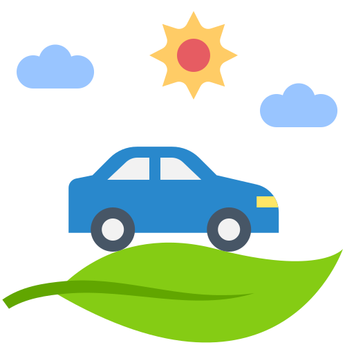
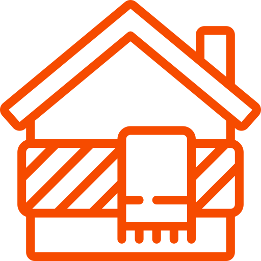
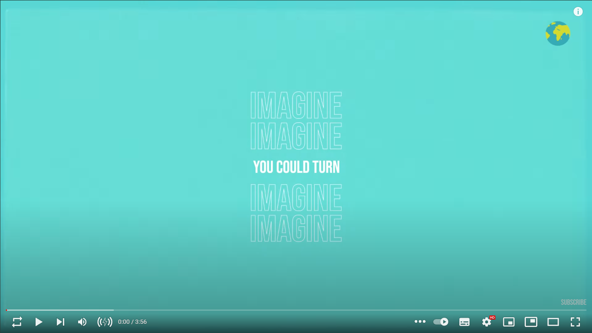

# Sustainable Living: Tips and Tricks for a Greener Lifestyle

## Table of Contents

- [Sustainable Living: Tips and Tricks for a Greener Lifestyle](#sustainable-living-tips-and-tricks-for-a-greener-lifestyle)
  - [Table of Contents](#table-of-contents)
  - [What is Sustainable Living?](#what-is-sustainable-living)
  - [What is NOT Sustainable Living?](#what-is-not-sustainable-living)
  - [Getting started with sustainable \& green living](#getting-started-with-sustainable--green-living)
  - [7 principles of sustainable living](#7-principles-of-sustainable-living)
  - [There are many things you can do to live a greener lifestyle. Here are some ideas to get you started:](#there-are-many-things-you-can-do-to-live-a-greener-lifestyle-here-are-some-ideas-to-get-you-started)
    - [Reduce your energy consumption](#reduce-your-energy-consumption)
    - [Use sustainable transportation](#use-sustainable-transportation)
    - [Reduce your water usage](#reduce-your-water-usage)
    - [Reduce your waste](#reduce-your-waste)
    - [Eat a plant-based diet](#eat-a-plant-based-diet)
    - [Support eco-friendly businesses](#support-eco-friendly-businesses)
    - [Get involved in your community](#get-involved-in-your-community)
    - [Reduce your washing](#reduce-your-washing)
    - [Clean with castile](#clean-with-castile)
    - [Go for plastic-free personal care](#go-for-plastic-free-personal-care)
    - [Recycle as much as you can](#recycle-as-much-as-you-can)
    - [Look after your electrical appliances](#look-after-your-electrical-appliances)
    - [Create clean air](#create-clean-air)
    - [Change your shower head](#change-your-shower-head)
    - [Use a cup while brushing your teeth](#use-a-cup-while-brushing-your-teeth)
    - [Opt for green energy suppliers](#opt-for-green-energy-suppliers)
    - [Practise eco-driving](#practise-eco-driving)
    - [Draught-proof your home](#draught-proof-your-home)
    - [Buy vintage furniture](#buy-vintage-furniture)
    - [Recycle your clothes and shop vintage](#recycle-your-clothes-and-shop-vintage)
    - [Optimise your white goods](#optimise-your-white-goods)
    - [Go smart](#go-smart)
    - [Insulate, Insulate, Insulate](#insulate-insulate-insulate)
    - [Use your own cup](#use-your-own-cup)
    - [Invest in renewable energy solutions](#invest-in-renewable-energy-solutions)
    - [Use LED Lights](#use-led-lights)
    - [Recycle And Recharge Batteries](#recycle-and-recharge-batteries)
    - [Practice mindful consumption by only buying what you need and repairing instead of replacing broken items](#practice-mindful-consumption-by-only-buying-what-you-need-and-repairing-instead-of-replacing-broken-items)
    - [Reduce paper usage:](#reduce-paper-usage)
    - [Support environmental organizations:](#support-environmental-organizations)
    - [Composting at Home](#composting-at-home)
  - [Get informed: Environmental News Sources](#get-informed-environmental-news-sources)
    - [ERM: The Sustainability Institute News](#erm-the-sustainability-institute-news)
    - [Business Green](#business-green)
    - [euronews: Sustainable Development](#euronews-sustainable-development)
    - [Reuters: Sustainable Business](#reuters-sustainable-business)
  - [Understanding the value of a sustainable lifestyle](#understanding-the-value-of-a-sustainable-lifestyle)
  - [Apps you can use to help you live sustainably](#apps-you-can-use-to-help-you-live-sustainably)
  - [Environmental Open-Source Projects](#environmental-open-source-projects)
  - [Eco-travel](#eco-travel)
    - [What is Eco-Travel?](#what-is-eco-travel)
    - [Benefits of Ecotourism](#benefits-of-ecotourism)
  - [Green Communities](#green-communities)
  - [Sustainable Living Case Studies](#sustainable-living-case-studies)
  - [10 free online games about sustainable living](#10-free-online-games-about-sustainable-living)
  - [5 false myths about sustainable living](#5-false-myths-about-sustainable-living)
  - [Testimonials](#testimonials)
    - [Emma Watson: Actress and UN Women Goodwill Ambassador.](#emma-watson-actress-and-un-women-goodwill-ambassador)
    - [Ashley Renne Nsonwu: Lifestyle educator and activist](#ashley-renne-nsonwu-lifestyle-educator-and-activist)
    - [Rob Greenfield: Community organizer](#rob-greenfield-community-organizer)
  - [European Union's (EU) 2030 Agenda for Sustainable Development](#european-unions-eu-2030-agenda-for-sustainable-development)
  - [Sustainable development goals](#sustainable-development-goals)
    - [THE 17 GOALS](#the-17-goals)
  - [Sustainable Living \& Business](#sustainable-living--business)
  - [The Line, Saudi Arabia](#the-line-saudi-arabia)
  - [Businesses that follow Sustainable Living](#businesses-that-follow-sustainable-living)
  - [Sustainable Fashion](#Sustainable-Fashion)
    - [Life Cycle Analysis](#Life-Cycle-Analysis)
    - [Sustainable clothing](#Sustainable-clothing)
    - [Recycled clothing](#Recycled-clothing)
    - [Trashion](#Trashion)
    - [High Fashion](#High-Fashion)
    - [Businesses in High Fashion](#Businesses-in-High-Fashion)
  - [Healthy \& Sustainable Recipes](#healthy--sustainable-recipes)
  - [Sustainable Art](#sustainable-art)
    - [What is Sustainable Art?](#what-is-sustainable-art)
    - [Categories of Sustainable Art](#categories-of-sustainable-art)
  - [Interesting videos](#interesting-videos)
  - [Interesting podcasts](#interesting-podcasts)
  - [Interesting Documentaries](#interesting-documentaries)
  - [Interesting Books](#interesting-books)
    - [Zero Waste Lifestyle](#zero-waste-lifestyle)
    - [Sustainable and Eco-Friendly Living](#sustainable-and-eco-friendly-living)
  - [Sustainability magazines and newsletters to sign up for](#sustainability-magazines-and-newsletters-to-sign-up-for)
  - [Best films to inspire sustainability](#best-films-to-inspire-sustainability)
  - [Donate!](#donate)
    - [Donate to a good cause of your choice:](#donate-to-a-good-cause-of-your-choice)
  - [Volunteer](#volunteer)
  - [Citations](#citations)
  - [Current Contributors](#current-contributors)

---

## What is Sustainable Living?

**Make the right decisions today, save the planet of tomorrow!**

The term Sustainable Living is used to express a lifestyle choice of reducing the carbon footprint and generally the use
of the Earth’s natural resources either as individuals or society.

The aim of Sustainable Living is to minimize as possible the harm inevitably caused to our planet by our own actions. In
our modern world of fast living and over consuming, we may not understand how important it is not only for us, but also
for the generations to come to protect and care after our environment. Climate change, rising sea levels, extreme
weather conditions and ozone layer thinning are all human induced problems that could result in our planet being doomed.

Despite the benefits of Sustainable Living to our environment, individuals that choose to live by that philosophy can
improve their well-being, both psychologically and physically. Generally, the quality of a person’s life is directly
affected by their habits and the way they choose to live. For example, Sustainable living can urge people to adopt
healthier habits and decrease their dependence on artificial machines by altering them in more eco-friendly options.

**In that way Sustainable Living makes you use less, want less, need less.**

<h5 align="right">

[back to the top](#table-of-contents)

</h5>

## What is NOT Sustainable Living?

To be clear about sustainability let's define un-sustainability as well with an example, shall we? So let's imagine you
wake up an in world where 100000000 (finite number) apples are laying down in the ground, that don't go bad - forever.
" Woooooooooooooow I have food forever" you think.
So you eat apples every day. But instead of eating one a day, you say:
" I have these many apples, why eat just one? Right people?"
And all your friends in your community agreed. So everyone started eating 10 apples a day (imaginary world okay?) and at
some point 100 and then 1000 and then 10000...
In the meantime, in your community people were having children that were getting used to having the privilege of eating
as many apples as they wanted.
However, as the number of apples is finite, the children got anxious and nervous at their parents for being so wasteful
and greedy with the apples, thinking they own them... So they started protesting but their parents didn't care. And they
kept eating and eating till 5 apples were left in the world. So no more apples for the children's generation.

So the conclusion of the story above is that we should always be aware of the resources which are generously given to us by nature
-the metaphor of the infinite apples- and use the ones needed, without being insatiable and greedy. Only in this way will we be able 
to create the right conditions for a more ecological and sustainable future, both for us and the generations to come.

<h5 align="right">

[back to the top](#table-of-contents)

</h5>

## Getting started with sustainable & green living

Defining environmental sustainability in a clear and intelligible way, is of paramount importance, in order to approach
this topic properly.
Following a green lifestyle, means to shape a way of life oriented to some earth-friendly key directions, stated below.

- Redefine your needs and develop lighter habits
- Protect natural resources by avoiding their overconsumption and safeguarding biodiversity
- Be actively aware of the current threats posed to environment (i.e. climate crisis components) and get eco-conscious
- Become more adaptive and open to eco-friendly practices

 Want an indicator on how you're doing? Take some time to check your footprint using the calculator listed below, so you can start reducing your footprint!

https://www.footprintcalculator.org/home/en

<h5 align="right">

[back to the top](#table-of-contents)

</h5>

## 7 principles of sustainable living

---

**1. Effective land use and wildlife protection**

Effective land use and wildlife protection are two crucial components of sustainable development. Land use refers to the
management of land resources in a way that optimizes economic, social, and environmental benefits while minimizing
negative impacts. On the other hand, wildlife protection involves the conservation and management of wild animals and
their habitats to ensure their survival.

Effective land use and wildlife protection are closely interconnected since land use decisions can have a significant
impact on wildlife and their habitats. For instance, unsustainable land use practices such as deforestation, land
conversion for agriculture or urbanization, and infrastructure development can lead to habitat loss, fragmentation, and
degradation, which threaten the survival of many species.

Therefore, it is essential to adopt land use practices that minimize negative impacts on wildlife and their habitats
while promoting sustainable economic development. This can be achieved through various approaches such as land-use
planning, zoning, protected area management, and wildlife conservation strategies that consider the needs of both people
and wildlife.

---

**2. Sustainable water usage**

Sustainable water usage is the responsible and efficient management of water resources to meet the needs of the present
without compromising the ability of future generations to meet their own needs. Sustainable water usage is essential
because water is a finite resource, and its availability is increasingly under pressure due to population growth,
climate change, and unsustainable water use practices.

Sustainable water usage involves managing water demand through conservation and efficiency measures, reducing water
losses through leakage prevention, and enhancing the quality of water resources through pollution control and wastewater
treatment. It also involves promoting the use of alternative water sources such as rainwater harvesting, groundwater
recharge, and recycled wastewater.

Effective management of sustainable water usage requires the involvement of all stakeholders, including water users,
water managers, policymakers, and communities. It requires the adoption of integrated water resource management
approaches that take into account the water needs of different sectors, such as agriculture, industry, and households,
as well as the ecological requirements of water-dependent ecosystems.

Sustainable water usage is critical for ensuring water security and resilience, protecting human health, and promoting
economic development. It also helps to mitigate the impacts of climate change by reducing water-related risks such as
floods, droughts, and water scarcity. By adopting sustainable water usage practices, we can ensure the availability of
water resources for future generations while maintaining the ecological integrity of our planet.

---

**3. Supporting local and organic foods**

Supporting local and organic foods is a sustainable food production and consumption practice that promotes the
consumption of locally grown, seasonal, and organic food. This approach aims to reduce the environmental impact of food
production, support local economies, and improve the health and well-being of consumers.

Local food refers to food produced within a certain geographical area, usually within 100 miles of the place of
consumption. By supporting local food, consumers reduce the carbon footprint of food transportation, support local
farmers and food producers, and promote food security and resilience.

Organic food, on the other hand, refers to food produced without the use of synthetic pesticides, fertilizers, and
genetically modified organisms (GMOs). Organic farming practices prioritize the use of renewable resources and the
conservation of biodiversity, soil fertility, and water quality.

Supporting local and organic foods also promotes healthier and more nutritious diets, as these foods tend to be fresher,
more diverse, and less processed. In addition, local and organic foods are often produced using more sustainable farming
methods, which help to reduce environmental impacts such as soil erosion, water pollution, and loss of biodiversity.

By supporting local and organic foods, consumers can help to create a more sustainable food system that supports local
economies, protects the environment, and promotes healthy and nutritious diets. This can be done by purchasing local and
organic foods from farmers markets, community-supported agriculture (CSA) programs, and other local food initiatives.

---

**4. The use of sustainable materials**

The use of sustainable materials refers to the practice of using materials that are environmentally responsible and have
a minimal impact on the planet's natural resources. The goal is to reduce waste, conserve energy and resources, and
minimize harm to the environment.

Sustainable materials can come from a variety of sources, including renewable resources like wood, bamboo, and cotton,
as well as recycled materials such as plastics, metals, and glass. These materials are often used in products that
promote environmental sustainability, such as eco-friendly clothing, packaging, building materials, and furniture.

In addition to their environmental benefits, sustainable materials can also provide economic benefits. For example,
using recycled materials can reduce production costs, while using renewable resources can create jobs and support local
economies.

Overall, the use of sustainable materials is an important practice for reducing our impact on the environment and
promoting a more sustainable future. By choosing products made from sustainable materials, we can help to reduce waste,
conserve resources, and protect the planet for future generations.

---

**5. The use of sustainable transport**

The use of sustainable transport refers to the practice of using modes of transportation that have a lower impact on the
environment and contribute to a more sustainable future. The most common forms of sustainable transport are walking,
cycling, and public transportation.

Walking and cycling are both sustainable modes of transport as they are powered by human energy and emit no pollution.
They also promote physical activity and can contribute to better health outcomes. However, they may not be practical for
long distances or in areas with challenging terrain.

Public transportation, such as buses and trains, is another form of sustainable transport. Public transportation systems
are typically powered by electricity or other low-emission fuels and are able to move large numbers of people at once,
reducing the number of individual cars on the road. This can help to reduce traffic congestion and air pollution.

Other forms of sustainable transport include electric vehicles (EVs) and car-sharing services. EVs are powered by
electricity and emit no tailpipe emissions, making them a cleaner alternative to traditional gasoline-powered vehicles.
Car-sharing services allow multiple individuals to use a single vehicle, reducing the number of cars on the road and the
associated environmental impact.

Overall, the use of sustainable transport is an important practice for reducing our impact on the environment and
promoting a more sustainable future. By choosing sustainable modes of transportation, we can help to reduce greenhouse
gas emissions, improve air quality, and reduce our reliance on fossil fuels.

---

**6. Zero waste and zero carbon**

Zero waste and zero carbon are two concepts that are closely related and are both aimed at reducing our impact on the
environment.

Zero waste refers to the practice of reducing, reusing, and recycling waste in order to divert it from landfills and
minimize our impact on the environment. The goal is to create a closed loop system in which resources are kept in use
for as long as possible, with the minimum amount of waste generated. This includes practices such as composting,
recycling, and reducing single-use plastics and packaging. By implementing zero waste practices, we can help to reduce
the amount of waste we produce and conserve natural resources.

Zero carbon, on the other hand, refers to the goal of achieving net-zero carbon emissions. This means that any carbon
emissions produced are offset by carbon sequestration or other measures. The primary sources of carbon emissions are
from the burning of fossil fuels for transportation, heating, and electricity. Achieving zero carbon requires
transitioning to renewable energy sources such as wind and solar power, as well as improving energy efficiency and
reducing overall energy consumption.

Both zero waste and zero carbon are important concepts for promoting sustainability and reducing our impact on the
environment. By reducing waste and carbon emissions, we can help to protect the planet for future generations and create
a more sustainable future.

---

**7. Creating own healthy environment**

Creating your own healthy environment involves taking steps to reduce exposure to harmful substances and promote a safe
and healthy living space. Here are some tips for creating a healthy environment:

- <b>Improve air quality</b>: Air pollution can negatively impact health, so it's important to take steps to improve
indoor air quality. This can include using air filters, opening windows for ventilation, and avoiding the use of harsh
chemicals and cleaners.

- <b>Reduce exposure to toxins</b>: Toxins such as lead, asbestos, and radon can be found in some homes and can be
harmful to health. Take steps to identify and remove any sources of toxins in your home.

- <b>Use non-toxic products</b>: Choose non-toxic products for cleaning, personal care, and household items. This can
help reduce exposure to harmful chemicals.

- <b>Promote natural light</b>: Natural light is important for both physical and mental health. Ensure that your home
has plenty of natural light and consider using light therapy if necessary.

- <b>Create a calm and relaxing environment</b>: A calm and relaxing environment can promote mental health and
well-being. This can be achieved by using calming colors, minimizing clutter, and incorporating natural elements such
as plants and nature sounds.

<h5 align="right">

[back to the top](#table-of-contents)

</h5>

---

## There are many things you can do to live a greener lifestyle. Here are some ideas to get you started:
  
   

### Reduce your energy consumption

One of the most effective ways to reduce your carbon footprint is to use less energy. You can do this by turning off
lights and electronics when you're not using them, using energy-efficient appliances, and sealing air leaks in your
home.

<h1 align="center">
	
<h4 align="right">

[Image source](https://icon-library.com/icon/energy-efficiency-icon-2.html)

</h4>
</h1>

### Use sustainable transportation

Instead of driving everywhere, consider walking, biking, or taking public transportation. This will not only reduce your
carbon footprint but also improve your health.

<h1 align="center">
	

<h4 align="right">

[Image source](https://www.thecivilengineer.org/news/european-cities-lead-the-way-to-sustainable-transport)

</h4>
</h1>

### Reduce your water usage

You can conserve water by taking shorter showers, fixing leaky faucets, and watering your lawn and garden only when
necessary.

<h1 align="center">
	
	<h4 align="right">

[Image source](https://www.ci.colton.ca.us/839/Water-Efficiency)

</h4>
</h1>

### Reduce your waste

Recycling is a great way to reduce waste, but it's even better to reduce the amount of waste you produce in the first
place. Consider using reusable bags, containers, and water bottles, and composting your food scraps.

<h1 align="center">
	
	<h4 align="right">

[Image source](https://www.thantmyanmar.com/en/engagement/reduce-plastic-waste-in-organizations)

</h4>
</h1>

### Eat a plant-based diet

Animal agriculture is a significant contributor to greenhouse gas emissions, so reducing your meat and dairy consumption
can have a big impact on the environment. Try incorporating more plant-based meals into your diet.

<h1 align="center">
	
		<h4 align="right">

[Image source](https://www.dreamstime.com/vegan-logo-vegetarian-vector-icon-spoon-fork-leaf-graphic-design-element-vegan-logo-vegetarian-vector-icon-spoon-image157713288)

</h4>
</h1>

### Support eco-friendly businesses

When shopping, look for products and businesses that prioritize sustainability and eco-friendliness. This can include
buying products made from recycled materials, choosing products with minimal packaging, and supporting local businesses.

<h1 align="center">
	
<h4 align="right">

[Image source](https://www.vecteezy.com/vector-art/5044617-eco-shopping-solid-green-vector-supermarket-cart-icon-with-leaves-image-isolated-on-white-background-organic-shopping-design-element-eco-shop-logo)

</h4>
</h1>

### Get involved in your community

Joining a local environmental organization or volunteering for environmental causes can help you make a positive impact
on the environment and connect with others who share your values.

<h1 align="center">
	
	<h4 align="right">

[Image source](https://kidsaidcolorado.org/volunteer/)

</h4>
</h1>

### Reduce your washing

- **_"Waste Not Every day" by Erin Rhoads_**, published by **Hardie Grant Books** and priced at £10, the biggest impact
  on the
  environment caused by fashion occurs after we bring clothing home. In fact, 82% of the energy a garment consumes is a
  result of the washing and drying we do every week. **Rhoads** proposes alternatives to traditional washing, such as
  spot-cleaning and using diluted vodka or lemon juice to eliminate odors.2

<h1 align="center">
	

<h4 align="right">

[Image source](https://www.flaticon.com/free-icon/washing-machine_3003984?term=washing+machine&page=1&position=4&origin=tag&related_id=3003984)

</h4>

</h1>

### Clean with castile

- In "Clean Green" by **Jen Chillingsworth**, published by **Quadrille** and priced at £7.55, it is suggested that
  making your
  own cleaning products, such as polish and detergent, can decrease the amount of plastic entering your home and
  minimize the release of harmful VOCs, including formaldehyde. **Chillingsworth** highly recommends liquid castile
  soap,
  which was traditionally made with pure olive oil from Spain, but is now commonly produced by blending vegetable oils
  like hemp, avocado, jojoba, and coconut. For a straightforward and versatile kitchen spray, combine 50ml of castile
  soap with 800ml of tap water in a spray bottle, and add a few drops of essential oils, such as tea tree oil, which has
  antibacterial properties. Finally, spray the solution and wipe it down with a clean cloth.2

<h1 align="center">
	

<h4 align="right">

[Image source](rigin=search&related_id=10052271)

</h4>
</h1>

### Go for plastic-free personal care

- According to **Chillingsworth**, there are numerous options to explore when it comes to waste-free sanitary
  protection,
  and she recommends purchasing a reusable tampon applicator. This applicator is reusable, fits any size of tampon, and
  is antimicrobial and simple to insert. Once used, it can be wiped, rinsed, and returned to its storage box, which
  conveniently fits in a purse. It should be sterilized in hot water between periods for hygiene purposes.2

<h1 align="center">
	

<h4 align="right">

[Image source](https://www.flaticon.com/free-icon/plastic-free_6588996?term=plastic-free&page=1&position=56&origin=search&related_id=6588996)

</h4>

</h1>

### Recycle as much as you can

- **Helen Bird**, a plastics expert at Wrap, a government waste advisory organization, states that many major
  supermarkets
  offer in-store collection points for stretchy plastics such as carrier bags, bread bags, and frozen food bags, which
  cannot typically be recycled at home.2

- **TerraCycle** is a company that specializes in rescuing waste that is difficult to recycle and is not handled by
  local
  councils. They offer national recycling programs free of charge, as well as sell zero-waste boxes that allow you to
  gather and return most non-organic, non-recyclable, and non-hazardous waste for recycling purposes. You can visit
  their website to locate a program in your area or establish your own.2

<h1 align="center">
	

<h4 align="right">

[Image source](https://www.flaticon.com/free-icon/recycle-symbol_1327264?term=recycle&page=1&position=1&origin=search&related_id=1327264)

</h4>

</h1>

### Look after your electrical appliances

- The Restart Project is a social enterprise that strives to improve our relationship with electronics and electrical
  items. According to cofounder **Janet Gunter**, the initial step to extend the lifespan of household appliances is to
  regularly clean and maintain them. By doing so, white goods, laptops, and mobile devices can last longer. Restart
  operates a nationwide network of skill-sharing workshops and promotes a commercial repair directory in London. To find
  similar events in your area, visit [repaircafe.org](https://www.repaircafe.org/en/). Gunter stresses that if spare
  parts are not accessible, these
  appliances may be discarded, resulting in a significant carbon impact.2

- If your electrical appliance is truly irreparable, **Rhoads** recommends contacting the manufacturer or the company
  from
  which you made the purchase to inquire if they would take back the item or its packaging for reuse or recycling. While
  not all charity shops accept electrical items, the homelessness charity Emmaus welcomes working items that are tested
  before being resold, making it a great place to purchase secondhand electrical goods as well.2

<h1 align="center">
	

<h4 align="right">

[Image source](https://www.flaticon.com/free-icon/wrench_2092041?term=repair&page=1&position=3&origin=search&related_id=2092041)

</h4>

</h1>

### Create clean air

- **Oliver Heath**, who operates a sustainable architecture practice, claims that "you can never have enough
  houseplants."
  He suggests specific plants for particular rooms, stating that "mother-in-law's tongue is ideal for the bedroom since
  it emits oxygen at night." Meanwhile, **Chillingsworth** claims that peace lilies and Boston ferns flourish in
  high-humidity environments and can decrease the concentration of mould spores in the air, making them suitable for
  bathrooms. Weeping figs are the best option for removing formaldehyde released by furniture and carpets, making them a
  suitable choice for living areas.2

<h1 align="center">
	

<h4 align="right">

[Image source](https://www.flaticon.com/free-icon/plants_1703178?term=plant&page=1&position=16&origin=search&related_id=1703178)

</h4>

</h1>

### Change your shower head

- According to Brian Horne from the **_Energy Saving Trust (EST)_**, "investing in an aerated shower head can have a
  significant impact on water and energy consumption." These shower heads incorporate air into the water flow, thereby
  reducing water usage. Horne explains that "a water-efficient shower head could save a four-person household £70 per
  year on gas for water heating, as well as an additional £115 on water bills if they use a meter."2

<h1 align="center">
	

<h4 align="right">

[Image source](https://www.flaticon.com/free-icon/shower_1752086?term=shower+head&page=1&position=5&origin=search&related_id=1752086)

</h4>

</h1>

### Use a cup while brushing your teeth

- According to <b>glencanyon.org</b> , not using a cup while brushing your teeth can result in spending extra 2-3
  gallons of water every day. Make sure to have a cup while brushing your teeth, and fill it with as much water as you
  will need. 5

<h1 align="center">
        

<h4 align="right">

[Image source](https://www.flaticon.com/free-icon/toothbrush_614651?term=toothbrush&page=1&position=6&origin=search&related_id=614651)

</h4>

</h1>

### Opt for green energy suppliers

- According to **Horne**, there are different levels of environmental friendliness to consider when selecting an energy
  provider. Last year, the EST recognized four suppliers, including Green Energy UK, Good Energy, Ecotricity, and
  Octopus Energy, who openly disclosed the renewable sources of their energy on their websites. Nevertheless, Horne
  cautions that even if you opt for a green energy plan, it does not mean that you can neglect energy conservation
  efforts.2

<h1 align="center">
	

<h4 align="right">

[Image source](https://www.flaticon.com/free-icon/green-energy_2990815?term=green+energy&page=1&position=7&origin=search&related_id=2990815)

</h4>

</h1>

### Practise eco-driving

- The **RAC Foundation's** research indicates that eco-driving practices result in journeys that are safer, less
  polluting,
  and more economical. By upkeeping vehicles, fuel efficiency can improve by up to 10%. Prior to embarking on a long
  trip, it is recommended to verify that tire pressures are adequate (underinflated tires by a quarter can result in a
  2% increase in fuel consumption), remove unnecessary roof racks and boxes, and avoid overloading the car (as every
  additional 45kg decreases fuel economy by 2%). When driving at less than 40mph, it is more energy-efficient to open a
  window rather than using air conditioning. It is advised to switch off engines if they are idle for more than a
  minute (since 5-8% of fuel is consumed while idling), and avoid sudden acceleration and heavy braking as it can
  significantly increase fuel consumption.2

<h1 align="center">
	

<h4 align="right">

[Image source](https://www.flaticon.com/free-icon/eco-friendly_8724870?term=eco-driving&page=1&position=8&origin=search&related_id=8724870)

</h4>

</h1>

### Draught-proof your home

- According to **Dr Sarah Price**, who heads building physics at **_Enhabit_**, a consultancy that specializes in
  low-energy
  design, draught-proofing windows, doors, letterboxes, fireplaces, and loft hatches is one of the most affordable and
  effective ways to save money and energy at home. It can be done professionally for approximately £200, or using
  products such as Gap Seal, as a DIY project.2

- Another easy way is to double-glaze your windows as non double-glazed windows can be the reason for a home to lose up
  to 30% of its heating or cooling.3 You can also combine the windows with curtains with heavy liners, to
  close them when the sun sets not to lose any extra heat.

<h1 align="center">
	

<h4 align="right">

[Image source](https://www.flaticon.com/free-icon/window_2197440?term=windows&page=1&position=9&origin=search&related_id=2197440)

</h4>

</h1>

### Buy vintage furniture

- Founder of interior design studio Harding and Read, **Nicola Harding**, suggests that reusing furniture is not only
  the best
  thing to do, but it is also more enjoyable than buying new. Secondhand items come with interesting stories and prompt
  creative thinking, resulting in something unique. To minimize transportation distance, Harding suggests starting with
  local auction houses and charity shops, such as the **_British Heart Foundation_**, which offers dedicated home stores
  and a
  free collection service. After that, a focused search can be conducted on platforms such as Freecycle and Facebook
  Marketplace.2

<h1 align="center">
	

<h4 align="right">

[Image source](https://www.flaticon.com/free-icon/clock_1171793?term=vintage+furniture&page=1&position=1&origin=search&related_id=1171793)

</h4>

</h1>

### Recycle your clothes and shop vintage

- A good way to avoid buying clothes from fast fashion brands, but still keep within an affordable price range is buying
  vintage clothes from thrift stores. The trend of thrifting is ever-growing and can even turn into a fun activity of
  fashion exploration.
- You have a few extra clothes cluttering your closet? Recycling your clothes is an excellent way to get rid of that
  problem, while also helping to effectively fight clothing waste and pollution. You can find clothing recycling bins
  from [Recycom](https://www.recycom.gr/%CE%B1%CE%BD%CE%B1%CE%BA%CF%8D%CE%BA%CE%BB%CF%89%CF%83%CE%B7/)
  and [Fabric Republic](http://www.fabricrepublic.gr/form-offer/) around your city and in select clothing stores.

<h1 align="center">
	

<h4 align="right">

[Image source](https://www.istockphoto.com/vector/green-concept-of-recycle-clothes-and-textile-gm1175986553-327704559)

</h4>

</h1>

### Optimise your white goods

- **U Switch**, an independent energy comparison service, suggests that the cost of running your fridge and freezer
  makes up
  approximately 7% of your total energy bill, as they are among the few household devices that are constantly on. To
  save energy, **U Switch** recommends replacing your fridge and/or freezer if it is over a decade old, even if it is
  still
  functioning. The cost of a new model will be offset by energy savings over time. Additionally, it is important to
  maintain your fridge's temperature at 5°C or below (most are kept at around 7°C, which causes food to spoil sooner),
  and ensure there is a 10cm gap behind it to allow heat to escape. Finally, check that the seal is strong, as if it
  cannot hold a piece of paper when closed, it may be allowing warm air to enter, forcing it to work harder.2

<h1 align="center">
	
<h4 align="right">

[Image source](https://www.flaticon.com/free-icon/development_2629663?term=optimize&page=1&position=27&origin=search&related_id=2629663)

</h4>

</h1>

### Go smart

- Try having smart home gadgets,
  like [programmable thermostat](https://www.energy.gov/energysaver/programmable-thermostats), leds or smart switches.
  This way you can control exactly when you use anything in your home and monitor how much do you use it.

<h1 align="center">
	
</h1>
<h4 align=right>

[Image source](https://www.flaticon.com/free-icon/ecology-364_10142464?term=eco&page=1&position=33&origin=search&related_id=10142464)

</h4>

### Insulate, Insulate, Insulate

- Your house isn't always that good at keeping in the heat. So try insulating around heat sources
  like [radiators](https://www.doityourself.com/stry/installing-reflective-insulation-behind-radiators), or places that
  are not usually insulating, like the attic.
- Chimney balloons are also another way of insulating your home, of course, if you have a chimney.

<h1 align="center">
	
</h1>
<h4 align=right>

[Image source](https://www.flaticon.com/free-icon/house_3638003?term=insulate&page=1&position=2&origin=search&related_id=3638003)

</h4>

### Use your own cup

- According to
  the [Guardian](https://www.theguardian.com/environment/2020/apr/26/why-britains-25-billion-paper-coffee-cups-are-an-eco-disaster)
  ,
  in the UK alone 2.5 billion paper cups were used, most of which were used only once. On average, a paper cup requires
  0.58 liters of water to be produced, and leaves a carbon footprint of 60.9 grams of carbon dioxide. By using your cup
  when buying a coffee, you can reduce the amount of waste produced by single-use cups, protect the environment and even
  spend less money long-term.

<h1 align="center">
	

<h4 align="right">

[Image source](https://www.flaticon.com/free-icon/paper-cup-of-coffee_66766?term=cup+of+coffee&page=1&position=60&origin=search&related_id=66766)

</h4>

</h1>

### Invest in renewable energy solutions

- Investing in renewable energy solutions, such as solar panels or wind turbines, can have a significant impact on
  reducing carbon emissions and mitigating the effects of climate change.

- Renewable energy is becoming increasingly accessible and affordable, and many governments offer incentives and tax
  credits for homeowners and businesses to invest in these technologies.

- By generating your own renewable energy, you can reduce your reliance on fossil fuels, save money on energy bills, and
  even generate income by selling surplus energy back to the grid.

<h1 align="center"> 
	

<h4 align="right">

[Image source](https://cdn-icons-png.flaticon.com/512/3520/3520305.png)

</h4>

</h1>

### Use LED Lights

- Sam Allcock, in his
  article [Sustainable Living: 5 Ways To Do Your Part for The Planet](https://wealthofgeeks.com/sustainable-living-5-ways-to-do-your-part-for-the-planet/)
  states that a good way to reduce your energy use and carbon footprint is replacing traditional bulbs with Light
  Emitting Diodes (LED) lights.

- LED lights have an exceptionally longer life span, while also consuming less energy. Also, unlike traditional bulbs,
  LED lights do not contain harmful materials and gasses, such as mercury. That way, you can save money of your
  electrical bill while also protecting yourself and the environment.

<h1 align="center"> 
	

<h4 align="right">

[Image source](https://www.flaticon.com/free-icon/led-light_6134700?term=led&page=1&position=33&origin=search&related_id=6134700)

</h4>

</h1>

### Recycle And Recharge Batteries

- Don't throw away used batteries in regular trash or choose rechargeable batteries. Most types of regular batteries
  contain materials and components very harmful both for people and the environment. They can be the cause to fires, or
  even explosions, and the pollution of soil.

- Here are some ways to recycle or safely discard conventional batteries, as stated by
  the [United States Environmental Protection Agency](https://www.epa.gov/recycle/used-household-batteries):
  1. To prevent fires from lithium-ion batteries, tape battery terminals and/or place batteries in separate plastic
     bags and never put these batteries in household garbage or recycling bins.
  2. Choose the right recycling spot closer to you. [Earth911](https://search.earth911.com/?what=Batteries) is a
     useful site for finding the right disposal spot.
  3. Send your used batteries in mail-in recycle programs, such as [Call2Recycle](https://www.call2recycle.org/).

<h1 align="center"> 
	

<h4 align="right">

[Image source](https://www.flaticon.com/free-icon/battery_10158226?term=battery&page=1&position=32&origin=search&related_id=10158226)

</h4>

</h1>

### Practice mindful consumption by only buying what you need and repairing instead of replacing broken items

It involves considering the environmental impact, social implications, and personal needs before making a purchase.

One business that encourages this movement is "Patagonia" which is a well-known outdoor apparel brand that is committed
to reducing its environmental impact and promoting fair labor practises.

We can adopt this mentality from books such as "The life-Changing Magic of Tidying Up" and "Cradle to Cradle".

By being intentional about the things we buy and consume, we can reduce our environmental impact and promote social
justice.

<h1 align="center"> 
	

<h4 align="right">

[Image source](https://www.flaticon.com/free-icon/consumption_4816164?term=mindful+consumption&page=1&position=1&origin=search&related_id=4816164ed_id=10158226)

</h4>

</h1>

### Reduce paper usage:

Paper usage is a significant contributor to deforestation and greenhouse gas emissions. The production of paper requires
large amounts of water and energy, and it often involves the use of harmful chemicals.

1. Go digital: Opt for electronic billing and statements, email instead of sending physical letters, and use digital
   tools like calendars and notes apps to reduce your need for paper.

2. Use online resources: Instead of buying books, magazines, or newspapers in physical form, consider using online
   resources such as e-books, online newspapers, or digital magazines.

3. Use paperless alternatives: Choose to pay your bills online instead of receiving paper bills, and use online
   invitations instead of physical ones. 

<h1 align="center"> 
	

<h4 align="right">

[Image source](https://www.flaticon.com/free-icon/paper_2541984?term=paper&related_id=2541984)

</h4>

</h1>

### Support environmental organizations:

Supporting environmental organizations is an important way to contribute to the protection of the environment.
Environmental organizations work to promote sustainable practices, protect endangered species, and advocate for
environmental policies and regulations. By supporting these organizations, individuals can help fund research,
educational programs, and activism aimed at preserving natural habitats, reducing pollution, and mitigating the effects
of climate change.

Support can come in many forms, such as :

1. Donating money: Many environmental organizations rely on donations from supporters to fund their operations, and any
   contribution can make a difference

2. Volunteering time: Volunteering with environmental organizations can also be a great way to get involved in the
   community and make a tangible impact on the environment

3. Spreading awareness about environmental issues: By spreading awareness and sharing information about environmental
   issues, individuals can also help to build a culture of environmental responsibility and encourage others to take
   action to protect the planet.

<h1 align="center"> 
	

<h4 align="right">

[Image source](https://www.flaticon.com/free-icon/help_2634585?term=volunteering&page=1&position=15&origin=search&related_id=2634585)

</h4>

</h1>

### Composting at Home

The process of composting is how nature recycles. One of the most effective things we can do to lessen our trash, combat
climate change, and create healthy soil is this, according to
the [United States Environmental Protection Agency](https://www.epa.gov/recycle/composting-home). We can transform our
waste streams into a useful, value-added soil supplement and use it to protect the environment and build resilient
communities by turning our food scraps and yard waste into compost.

**What You Can Compost at Home:**

- Nitrogen-Rich Material (“Greens”)

  - Food and vegetable scraps
  - Most grass clippings and yard trim
  - Coffee grounds and paper filters
  - Paper tea bags (no staples)
  - Eggshells (crushed)

- Carbon-Rich Materials (“Browns”)
  - Dry leaves
  - Plant stalks and twigs
  - Shredded paper (non-glossy, not colored) and shredded brown bags
  - Shredded cardboard (no wax coating, tape, or glue)
  - Untreated wood chips

**What to Avoid Composting at Home:**

- Meat, fish and bones
- Cheese and dairy products
- Pet waste and cat litter
- Produce stickers
- Cooked food (small amounts are fine)
- Fats, oils and greases

**DIY Composting**

1. Add kitchen scraps and organic matter to a bin with a 25:1 - 40:1 browns to greens ratio. You don't have to purchase
   microorganisms as they naturally exist in carbon and nitrogen sources.
2. The pile must be humid but not wet. Add sawdust to dry it or water to moisten it as needed.
3. Stir the contents of the pile regularly. Turning the compost promotes oxygen flow and releases the heat that builds
   during decomposition. The ideal temperature should be between 32°-60° Celsius.
4. Your compost is will be ready to use after several months, when the color is dark, the content crumbles, and it stops
   emitting heat. You should avoid unfinished compost on your garden, as it tends to be toxic for plants.

<h1 align="center"> 
	

<h4 align="right">

[Image source](https://www.flaticon.com/free-icon/composting_4660792?term=compost&page=1&position=1&origin=search&related_id=4660792)

</h4>

</h1>

<h5 align="right">

[back to the top](#table-of-contents)

</h5>

## Get informed: Environmental News Sources

In order to lead an environmentally conscious lifestyle you should always be informed about the newest legislations and updates. Here you can find some news sources based around sustainability.

---

### [ERM: The Sustainability Institute News](https://www.sustainability.com/news/)

---

### [Business Green](https://www.businessgreen.com/type/news)

---

### [euronews: Sustainable Development](https://www.euronews.com/tag/sustainable-development)

---

### [Reuters: Sustainable Business](https://www.reuters.com/business/sustainable-business/)

<h5 align="right">

[back to the top](#table-of-contents)

</h5>

## Understanding the value of a sustainable lifestyle

Applying and including the above practices to your everyday life, will certainly be beneficial and valuable for both
sides. To be more specific, we present you some demonstrative rewarding cases.

- Restrict your negative environmental impact

  - reduce your carbon footprint
  - protect the planet's natural resources

- Lessen your daily expenses, that being:

  - green energy is cost-effective and keeps your electricity bills at low levels
  - eco-friendly products are gradually becoming more affordable

- Pave the way for a healthier life

  - a vegetarian-oriented nutrition is a lifesaver for addressing potential health issues leading to improved overall
    health and well-being

- Share and spread your green lifestyle profile

  - inspire and bring more people closer to the sustainable living model
  - don't forget that it's all about collaboration and contribution when we need game-changing results
  - make the first step for the desired domino effect

- Support local communities
  - create a more resilient and equitable economy

<h5 align="right">

[back to the top](#table-of-contents)

</h5>

---

## Apps you can use to help you live sustainably

- [Ecosia](#ecosia)
- [Geco Air](#geco-air)
- [Good On You](#good-on-you)
- [JouleBug](#joulebug)
- [Olio](#olio)
- [Too Good To Go](#too-good-to-go)
- [Forest: Focus for Productivity](#forest-focus-for-productivity)

 

<!-- ECOSIA -->

<h3 style="font-size:20px" align="center">Ecosia</h3>

 
	 

[Image source](https://play-lh.googleusercontent.com/_nuyeEgn6In53vmNpgZkj2nVyR26CPZe3QxKOIk1jWVqwkt4WGWo6m4k4CGNS_3C7Og=s48-rw)

 

Get Ecosia’s browser to start planting trees with your searches. Ecosia is a search engine that makes money through ads,
but uses 100% of the profits for the planet. The Ecosia community has already planted 150 million trees in over 35
countries.

Get it on: [Google Play](https://play.google.com/store/apps/details?id=com.ecosia.android&hl=en&gl=US)
, [App Store](https://apps.apple.com/us/app/ecosia/id670881887)

 

  

 

---

 

<!-- GECO AIR -->

<h3 style="font-size:20px" align="center">Geco air</h3>
 

 
 

[Image source](https://play-lh.googleusercontent.com/bdcArYWzNKkmbUnNl1HS2egdggpNOazIAJhve_atbD2_dLEbkAidVz39EsMgHZV4DecH=w240-h480-rw)

 
 
Geco air is your mobility companion that allows you to reduce the pollution linked to your displacements. Benefit from personalized advice to improve your driving style or mobility habits.

Get it on: [Google Play](https://play.google.com/store/apps/details?id=com.ifpen.gecoair&hl=en&gl=US)
, [App Store](https://apps.apple.com/us/app/geco-air-air-quality/id1169064121)

---

 

<!-- GOOD ON YOU -->

<h3 style="font-size:20px" align="center">Good On You</h3>
 

 
 

[Image source](https://play-lh.googleusercontent.com/injy4nSwxxpDd5XMuQ_Dimy_DGqQn0SBGHO3QQr35P6PmEomhd38J5cCNefkHu_qAK0)

 
 
Good On You is your go-to source for fashion sustainability ratings. Become one of the more than a million people using Good On You to purchase more wisely and build a sustainable future. You have the ability to quickly assess how your favorite clothing manufacturers are affecting the causes that are important to you thanks to the Good On You app. Using the app to find superior substitutes, learn more about ethical fashion purchasing, and receive exclusive offers from the top brands.

Get it on: [Google Play](https://play.google.com/store/apps/details?id=au.org.goodonyou.goodonyou&hl=en)
, [App Store](https://apps.apple.com/us/app/good-on-you-ethical-fashion-app/id1044017998)

---

 

<!-- JOULEBUG -->

<h3 style="font-size:20px" align="center">JouleBug</h3>
 

 
	 

[Image source](https://www.educationalappstore.com/images/upload/10750-logo-joulebug.jpg)

 
 
JouleBug aims to encourage sustainable behaviors in your daily routine by making them easy and enjoyable, rather than tedious or challenging.

Get it on: [Google Play](https://play.google.com/store/apps/details?id=com.cleanbit.joulebug&gl=US&pli=1)
, [App Store](https://apps.apple.com/us/app/joulebug/id391199306)

---

 

<!-- OLIO -->

<h3 style="font-size:20px" align="center">Olio</h3>
 

 
	 

[Image source](https://upload.wikimedia.org/wikipedia/commons/thumb/e/e7/Olio_new_logo.png/220px-Olio_new_logo.png)

 

Olio is a food-sharing app that allows you to connect with neighbors and local businesses to share excess food that
might otherwise go to waste.

Get it on: [Google Play](https://play.google.com/store/apps/details?id=com.olioex.android&hl=en&gl=US)
, [App Store](https://apps.apple.com/gb/app/olio/id1008237086)

---

 

<!-- TOO GOOD TO GO -->

<h3 style="font-size:20px" align="center">Too Good To Go</h3>
 

 
	 

[Image source](https://seeklogo.com/images/T/too-good-to-go-logo-D34C48CD2D-seeklogo.com.png)

 

Too Good To Go is a mobile app that helps reduce food waste by connecting users with local restaurants and stores that
have surplus food. Users can purchase food at a discounted price through the app, and the food is rescued from being
thrown away.

Get it
on: [Google Play](https://play.google.com/store/apps/details?id=com.app.tgtg&gl=US)
, [App Store](https://apps.apple.com/us/app/too-good-to-go-end-food-waste/id1060683933)

---

 

<!-- FOREST: FOCUS FOR PRODUCTIVITY -->

<h3 style="font-size:20px" align="center">Forest: Focus for Productivity</h3>
 

 
	 

[Image source](https://www.google.com/imgres?imgurl=https%3A%2F%2Fwww.forestapp.cc%2Fimg%2Ficon.png&tbnid=Xltw8KDFtCc7SM&vet=12ahUKEwixiJeyyff9AhWdgv0HHT0JASoQMygAegUIARDDAQ..i&imgrefurl=https%3A%2F%2Fwww.forestapp.cc%2F&docid=e7DyXVxXfK2oFM&w=1024&h=1024&q=forest%20app%20logo&hl=en&client=opera-gx&ved=2ahUKEwixiJeyyff9AhWdgv0HHT0JASoQMygAegUIARDDAQ)

 

Forest is a mobile application that helps you increase your productivity using
the [Pomodoro technique](https://en.wikipedia.org/wiki/Pomodoro_Technique) with a nuance: planting trees. Inside the app
you can plant virtual trees, that in turn give you in-app currency, and when you spend it, trees in real life are grown!
As of now, over 1.5 million trees have been planted around the world!

Get it
on: [Google Play](https://play.google.com/store/apps/details?id=cc.forestapp&hl=en&gl=US)
, [App Store](https://apps.apple.com/us/app/forest-focus-for-productivity/id866450515)

---

<h5 align="right">

[back to the top](#table-of-contents)

</h5>

 

## Environmental Open-Source Projects

- [Eco Hacker Farm](#eco_hacker_farm)
- [Open Climate Workbench](#open-climate-workbench)
- [Pangeo](#Pangeo)
- [Leaflet](#Leaflet)

 

<!-- Echo_Hacker_Farm -->

<h3 style="font-size:20px" align="center">Eco Hacker Farm</h3>
 

 
	 

 

Eco Hacker Farm is an organization that helps to set up and support, new and existing projects that combine hackerspaces
with permaculture farms to provide a sustainable living space for people to experience a way of life that is not
necessarily dependent on the system but using appropriate, open source and low-cost technological solutions.

Learn More about it in : [Website](https://wiki.ecohackerfarm.org)

---

 

<!-- Open_Climate_Workbench-->

<h3 style="font-size:20px" align="center">Open Climate Workbench</h3>
 

 
	 

 

Apache Open Climate Workbench is an effort to develop software that performs climate model evaluation using model
outputs from a variety of different sources the Earth System Grid Federation, the Coordinated Regional Climate
Downscaling Experiment, the U.S. National Climate Assessment and the North American Regional Climate Change Assessment
Program and temporal/spatial scales with remote sensing data from NASA, NOAA and other agencies. The toolkit includes
capabilities for rebinning, metrics computation and visualization.

Learn More about it in : [Website](https://climate.apache.org)

---

 

<!-- Pangeo-->

<h3 style="font-size:20px" align="center">Pangeo</h3>
 

 
	 

 

Fostering collaboration around open source and big data tools to enable research in ocean, atmosphere, land, and
climate, "Pangeo is first and foremost a community promoting open, reproducible, and scalable science." Big data can
change the world!

Learn More about it in : [Website](https://pangeo.io)

 

---

 

<!-- Leaflet-->

<h3 style="font-size:20px" align="center">Leaflet</h3>
 

 
	 

 

Leaflet is a well-known open source JavaScript library. It can be used for all sorts of things, including
environmentally friendly projects like the [Arctic Web Map](https://webmap.arcticconnect.ca/#ac_3573/2/90.0/0.0), which
allows scientists to accurately visualize and analyze the arctic region, a critical ability for climate research.

Learn More about it in : [Website](https://leafletjs.com/)

---

<h5 align="right">

[back to the top](#table-of-contents)

</h5>

 

## Eco-travel

### What is Eco-Travel?

In simple terms, ecotourism refers to responsible travel. When people travel overseas, they frequently stay at places where tourism has rendered the local environment completely uninhabitable. Adventure travel that improves and protects the environment while enhancing local communities' well-being is the focus of ecotourism. Eco-travel provides people with a more genuine adventure experience and more chances to establish long-lasting relationships with the locals while also enhancing the ecosystem. Destination: Earth places a high priority on sustainability and humanitarian travel, which is obvious in each of our eco-adventures.

### Benefits of Ecotourism

Among the advantages of ecotourism are:

1. Preserve the natural environment
2. Help the local economy
3. Empower local communities
4. Build sincere connections
5. Preserve the biological and cultural variety of the area
6. Reduce the impact on the region's natural resources.

Source: [Destination earth](https://destination-earth.org/)

<h5 align="right">

[back to the top](#table-of-contents)

</h5>

 

## Green Communities

Green communities emerged in the 1960s such as Reston and Columbia. Now they exist all around the world.

They are characterized by the use of ecologically friendly techniques to serve the requirements of its citizens. While
lowering their carbon footprint, these communities aim to save future generations from degradation of the land, air, and
water.

<h5 align="right">

[back to the top](#table-of-contents)

</h5>

---

## Sustainable Living Case Studies

Here are some examples of sustainable living case studies:

1. **The Green School:** The Green School is an eco-friendly school located in Bali, Indonesia. The school was built
   using sustainable materials such as bamboo, and promotes sustainable living practices such as composting and organic
   gardening. The school also has a zero-waste policy and has implemented a rainwater harvesting system to reduce water
   waste. The Green School aims to provide an education that is focused on sustainability and environmental stewardship.
   [More...](https://www.greenschool.org/bali/)
2. **The Warka Water Tower:** The Warka Water Tower is a sustainable water harvesting system developed by Italian
   architect Arturo Vittori. The tower uses a mesh net to collect moisture from the air, which is then filtered and
   stored in a tower. The tower can hold up to 100 liters of water, providing a sustainable source of drinking water for
   rural communities. The tower is made from locally sourced materials and is designed to be easy to maintain and
   repair.
   [More...](https://warkawater.org/warkatower/)
3. **The Beddington Zero Energy Development (BedZED):** BedZED is a sustainable housing development located in London,
   England. The development includes 100 homes and several office spaces, all of which are designed to be zero-carbon
   and energy-efficient. The homes feature a range of sustainable technologies, such as solar panels, rainwater
   harvesting, and composting toilets, and are built with sustainable materials. BedZED is considered a pioneering
   example of sustainable housing development.
   [More...](https://www.zedfactory.com/bedzed)

<h5 align="right">

[back to the top](#table-of-contents)

</h5>

## 10 free online games about sustainable living

Who says that learning how to live sustainably cannot be fun?

---

**1. EcoChains: Arctic Life**

This game challenges players to build and manage a sustainable city by making decisions about energy production,
transportation, and other factors.

---

**2. Energy City**

This game challenges players to build and manage a sustainable city by making decisions about energy production,
transportation, and other factors.

---

**3. Earth Day Quiz**

This quiz game tests players' knowledge about environmental issues and sustainability.

---

**4. Trash Tycoon**

In this game, players run a recycling company and manage waste in order to keep the environment clean and healthy.

---

**5. Water Life**

This game is about managing a virtual aquarium and making decisions that affect the health and sustainability of the
marine ecosystem.

---

**6. Climate Challenge**

This game puts players in charge of a country and challenges them to reduce carbon emissions while maintaining economic
growth and social welfare.

---

**7. Recycle Roundup**

In this game, players help clean up a park by sorting different types of trash into the correct recycling bins.

---

**8. The Coral Reef Game**

This game teaches players about the importance of coral reefs and the threats they face, as well as how to protect them.

---

**9. Plan it Green**

This game challenges players to build and manage a sustainable city by making decisions about energy, transportation,
and other factors.

---

**10. Global Warning**

This game is about managing resources and reducing carbon emissions in order to prevent catastrophic climate change.

<h5 align="right">

[back to the top](#table-of-contents)

</h5>

## 5 false myths about sustainable living

There are several myths about sustainable living that are widely believed but false. Here are a few examples:

---

**1. Myth: Sustainable living is expensive and only for the wealthy.**

Fact: While some sustainable products may have higher upfront costs, sustainable living can actually save money in the
long run. For example, energy-efficient appliances and LED light bulbs can save money on utility bills. Additionally,
sustainable living can involve making lifestyle changes, such as reducing meat consumption, which can lead to cost
savings. (7 Myths About Sustainable Living That Need to Be Debunked, EcoWatch, 2019)

---

**2. Myth: Sustainable living means giving up modern conveniences.**

Fact: Sustainable living is not about giving up modern conveniences, but rather finding ways to use them more
efficiently and responsibly. For example, using a reusable water bottle instead of single-use plastic bottles is a
simple way to reduce waste without giving up the convenience of having water on-the-go. (5 Myths About Sustainable
Living, One Green Planet, 2018)

---

**3. Myth: Sustainable living requires living off the grid.**

Fact: While living off the grid is one option for sustainable living, it is not the only one. Sustainable living can be
achieved in many ways, such as reducing energy consumption, using public transportation, or buying locally-sourced
products. (The Top 5 Myths About Sustainable Living, MindBodyGreen, 2019)

---

**4. Myth: Sustainable living is too difficult and time-consuming.**

Fact: Sustainable living can be as simple or as complex as you make it. Even small changes, such as using cloth napkins
instead of paper ones or turning off lights when leaving a room, can make a difference. Sustainable living is about
making conscious choices that align with your values and goals. (5 Myths About Sustainable Living, One Green Planet, 2018)

---

**5. Myth: Sustainable living is only for environmentalists.**

Fact: Sustainable living is for everyone. While many people may be drawn to sustainable living for environmental
reasons, the benefits extend beyond just the planet. Sustainable living can also improve health, save money, and build
stronger communities. (7 Myths About Sustainable Living That Need to Be Debunked, EcoWatch, 2019)

---

<h5 align="right">

[back to the top](#table-of-contents)

</h5>

## Testimonials

In this section we will talk about experiences and personal stories of people who embraced sustainable living mindset.

### Emma Watson: Actress and UN Women Goodwill Ambassador.

> Emma Watson has spoken publicly about her commitment to sustainability and environmentalism in various interviews and speeches.

Emma Watson has been an advocate for sustainable fashion and launched the Good On You app, which helps users discover eco-friendly and ethical clothing brands. She has also spoken out about the importance of reducing plastic waste and supports organizations like Greenpeace and Sky Ocean Rescue.

- [Instagram](https://www.instagram.com/emmawatson/?hl=el)
- [Twitter](https://twitter.com/EmmaWatson)

### Ashley Renne Nsonwu: Lifestyle educator and activist

> Ashley Renne Nsonwu is a vegan educator aiming to help people learn through her social media page. She helps people adapt to plant-based diets and learn how to shop for plant-based beauty products.

In her page you can find useful sustainability tips such as how to drink zero-waste coffee and how to reduce waste in your bathroom. Alongside the environmental issues she also tackles social issues like how pollution is connected to police brutality.

- [Instagram](https://www.instagram.com/heyashleyrenne/?hl=en)
- [Twitter](https://twitter.com/HeyAshleyRenne)

### Rob Greenfield: Community organizer

> Rob Greenfield is a community organizer and educator who roams the US showing people how they can minimize their environmental impact to live in harmony with the planet.

Over the years, he’s helped grow the home garden movement, showed how to live outside the corporate food system, combatted food waste, and demonstrated how to live waste-free.

- [Instagram](https://www.instagram.com/robjgreenfield/?hl=en)
- [Twitter](https://twitter.com/RobJGreenfield)
- [Youtube](https://www.youtube.com/channel/UCKirXBZV7hE4Fws3VSdYkRQ)

[Source](https://www.globalcitizen.org/en/content/environmental-activists-to-follow-carbon-footprint/)

<h5 align="right">

[back to the top](#table-of-contents)

</h5>

## European Union's (EU) 2030 Agenda for Sustainable Development

EU's [2030 agenda](https://sdgs.un.org/2030agenda) is a large and ambitious project, aimed to tackle many issues
humanity faces, related to the UN's [17 Sustainable Development Goals](#sustainable-development-goals). It comprises 169
targets related to _People_, _Planet_, _Prosperity_, _Peace_, and _Partnership_.

- **People**: everyone deserves to have the opportunity to live a dignified life, away from poverty and realize their
  dreams and potential.
- **Planet**: we have to protect our planet from its demise, embracing sustainable means in production and consumption,
  optimizing our natural resource management, ensuring that the present and future generations can survive.
- **Prosperity**: everybody should be able to live in economic, social and technological prosperity.
- **Peace**: sustainable development needs a world where people will no longer live in conflict and violence.
- **Partnership**: to achieve goals of sustainable development, we have to work together as we depend on each other to
  prosper.

<h5 align="right">

[back to the top](#table-of-contents)

</h5>

 
	 

 

[Image source](https://gcap.global/wp-content/uploads/2018/11/SGDs.png)

 

## Sustainable development goals

The Sustainable Development Goals (SDGs), also referred to as the Global Goals, were enacted by the United Nations in
2015 as a worldwide call to action to end poverty, protect the planet, and guarantee that by the year 2030, peace and
prosperity will be enjoyed by all.

The 17 SDGs acknowledge that development must balance social, economic, and environmental sustainability and that
actions in one area will have an impact on results in others.
Countries have agreed to give those who are falling behind the most priority when making progress. The SDGs aim to
eradicate AIDS, starvation, poverty, and prejudice against women and girls.
The SDGs must be achieved in every situation, and this requires the creativity, knowledge, technology, and financial
resources of the entire community.

### THE 17 GOALS

1. **No poverty:**
   End poverty in all its forms everywhere
2. **Zero Hunger:**
   End hunger, achieve food security and improved nutrition and promote sustainable agriculture
3. **Good Health and well-being:**
   Ensure healthy lives and promote well-being for all at all ages
4. **Quality Education:**
   Ensure inclusive and equitable quality education and promote lifelong learning opportunities for all
5. **Gender Equality:**
   Achieve gender equality and empower all women and girls
6. **Clean Water and Sanitation:**
   Ensure availability and sustainable management of water and sanitation for all
7. **Affordable and Clean Energy:**
   Ensure access to affordable, reliable, sustainable and modern energy for all
8. **Decent Work and Economic Growth:**
   Promote sustained, inclusive and sustainable economic growth, full and productive employment and decent work for all
9. **Industry, Innovation and Infrastructure:**
   Build resilient infrastructure, promote inclusive and sustainable industrialization and foster innovation
10. **Reduced Inequalities:**
    Reduce inequality within and among countries
11. **Sustainable Cities:**
    Make cities and human settlements inclusive, safe, resilient and sustainable
12. **Responsible Consumption and Production:**
    Ensure sustainable consumption and production patterns
13. **Climate Action:**
    Take urgent action to combat climate change and its impacts
14. **Life Below Water:**
    Conserve and sustainably use the oceans, seas and marine resources for sustainable development
15. **Life on Land:**
    Protect, restore and promote sustainable use of terrestrial ecosystems, sustainably manage forests, combat
    desertification, and halt and reverse land degradation and halt biodiversity loss
16. **Peace, Justice and Strong Institutions:**
    Promote peaceful and inclusive societies for sustainable development, provide access to justice for all and build
    effective, accountable and inclusive institutions at all levels
17. **Partnerships for the goals:**
    Strengthen the means of implementation and revitalize the Global Partnership for Sustainable Development

Source: [United Nations](https://sdgs.un.org/goals)

<h5 align="right">

[back to the top](#table-of-contents)

</h5>

## Sustainable Living & Business

Sustainable living in business refers to the practice of conducting business operations in a manner that minimizes
negative impacts on the environment, society, and economy. This involves adopting sustainable business practices that
promote environmental stewardship, social responsibility, and economic prosperity.

Here are some ways businesses can promote sustainable living:

1. **Reduce Energy Consumption**: Businesses can reduce their energy consumption by implementing energy-efficient
   practices such as using LED lights, installing solar panels, and optimizing heating and cooling systems.

2. **Reduce Waste**: Businesses can reduce waste by implementing recycling and composting programs, reducing paper
   usage, and using eco-friendly products and packaging.

3. **Encourage Remote Work**: Your electricity bill will go down right away if you encourage remote work. Lighting,
   climate control, and plugged-in office equipment will cost less. Less environmental stress results from those energy
   savings.
   Also, workers who don't drive to work don't contribute to the atmosphere's damaging greenhouse gas emissions. They
   consume fewer fossil fuels each week, which helps the environment and saves them money.

4. **Sustainable Sourcing**: Businesses can source sustainable materials, ingredients, and products that have a lower
   environmental impact.

5. **Employee Engagement**: Encouraging employee involvement in sustainability efforts can create a culture of
   sustainability within the workplace and inspire new ideas and initiatives.

6. **Social Responsibility**: Businesses can promote social responsibility by supporting local communities, investing in
   social causes, and ensuring fair and ethical practices in their supply chains.

7. **Transparency**: By being transparent about their sustainability efforts, businesses can build trust with their
   customers and stakeholders and demonstrate their commitment to sustainable living.

<h5 align="right">

[back to the top](#table-of-contents)

</h5>

## The Line, Saudi Arabia

The Line is a civilizational revolution in urban living, that puts humans first by providing an unprecedented urban living experience.
The project is a **linear smart city** under construction situated in **Saudi Arabia**, and it is part of [Saudi Vision 2030](https://en.wikipedia.org/wiki/Saudi_Vision_2030) project.

The city is estimated to populate 9 million residents, allover its 170 kilometer long length.

<!-- The Line -->

 
	 

[Image source](https://www.neom.com/en-us/regions/theline)

Its sustainability plan: The city will use entirely renewable energy, and it will consist of 3 layers; one on the surface for pedestrians, one underground for infrastructure, and another underground for transportation. (https://en.wikipedia.org/wiki/The_Line,_Saudi_Arabia)

No roads, cars or emissions, it will run on 100% renewable energy and 95% of land will be preserved for nature. People's health and wellbeing will be prioritized over transportation and infrastructure, unlike traditional cities.(https://www.neom.com/en-us/regions/theline)

<h5 align="right">

[back to the top](#table-of-contents)

</h5>

## Businesses that follow Sustainable Living 

The last few years, more and more businesses are starting to follow a way of living based on the value of sustainability, meaning that they prioritize environmental, social, and economic sustainability in their operations.

1. **Patagonia**: Patagonia is an outdoor clothing and gear company and has been a leader in sustainability for many years. They have chosen to use eco-friendly materials in their products, prioritize fair labor practices, and donate 1% of their sales to environmental causes.

During the past few months, almost all the products of paragonia, around 94%, are made from reused materials. Their production line are created organically by virgin cotton. By this way, they achieved saving water and reducing carbon emissions by 45%. 

2. **Unilever**: Unilever is a british company that has a high portfolio of Food, Ice Cream and Ηousehold & Personal Care and Hygiene. Unilever has 26 categories of products with approximately 1.400 products.

Unilever decided to build sustainable ways of living and communities in order to achieve growth as a company. In 2005, Unilever launched "Brand Imprint" initiative, in order to engage 2 billion customers per day that use more than 400 hundred brands in the effort of reducing environmental waste.

3. **Tesla**: Tesla is an automotive and energy company. Their main cause is to design, develop and manufacture vehicles runned by electricity and solar panels.

In 2021, Tesla's vehicles, energy storage, and solar panels achieved the reduction of 8.4 million metric tons of carbon emission.

Tesla's efforts aim for the whole world to turn to the use of sustainable energy. That's why Tesla increased its production line, in order to help everyone have access to all the products of Tesla. Their goal is to sell 20 million electric vehicles by 2030.

4. **IKEA**: IKEA is a swedish company that produces and sells home furniture by 1943 and its belief is that home is the most important place in the world.

Their effort to contribute on a more sustainable way of living is based on their collaboration with partners, co-workers and customers. 

IKEA is trying to implement some new ideas in order to contribute on sustainable living by innovating water saving solutions. This can be achieved by developing and manufacturing products that can help save water, such as water nozzles. In addition, it can be achieved by enabling people having clean air at their home. This can be accomplished by producing affordable air purifiers.

5. **Starbucks**: Starbucks is a worldwide known American brand for coffehouses. This company offers multiple blends of coffee and handmade beverages.

Starbucks is committed to reduce carbon emissions, eliminate waste and save water. Its focuses are:
<ul>
   <li>Expanding plant-based menu options</li>
   <li>Shifting away from single-use reusable packaging</li>
   <li>Investing in regenerative agriculture, reforestation, forest conservation and water replenishment in our supply chain</li>
   <li>Working on better ways to manage our waste</li>
   <li>Innovating with more responsible stores, operations, manufacturing and delivery</li>
</ul>
(As these are mentioned on the official website of Starbucks) 

 
 

6. **Interface**: Interface is a carpet tile company that has made sustainability a key part of its business model. The company uses recycled materials in its products, and has a goal of becoming a carbon negative company by 2040. 
   
Here are some examples of their sustainability initiatives:
<ul>
   <li>Mission Zero: Interface's Mission Zero is a commitment to eliminate any negative impact the company may have on the environment by 2020. The company has made progress towards this goal by reducing its carbon emissions, water usage, and waste sent to landfills.</li>
   <li>Closed-Loop Manufacturing: Interface has developed a closed-loop manufacturing process that uses recycled materials to create new flooring products. The company has also developed a program called ReEntry 2.0, which collects old carpet tiles from customers and recycles them into new products.</li>
   <li>Net-Works: Net-Works is a partnership between Interface and the Zoological Society of London that collects discarded fishing nets from fishing communities in the Philippines and recycles them into carpet tiles. This program helps to reduce waste in the oceans and provides additional income for local communities.</li>
</ul>

7. **Seventh Generation**: Seventh Generation is a cleaning and personal care products company that focuses on environmentally-friendly and sustainable products. The company uses plant-based ingredients and recycled packaging in its products.

Here are some examples of their sustainability practices:
<ul>
   <li>Renewable Energy: Seventh Generation has committed to using 100% renewable energy in its manufacturing facilities by 2020. The company has also invested in renewable energy projects, such as wind power and solar power.</li>
   <li>Packaging: Seventh Generation has worked to reduce the environmental impact of its product packaging. The company uses recycled materials in its packaging and has reduced the size and weight of its products to minimize the use of resources.</li>
   <li>Ingredient Transparency: Seventh Generation is committed to transparency about the ingredients used in its products. The company provides detailed information on its website about the ingredients used in each product and the potential health and environmental impacts of those ingredients.</li>
</ul>

8. **Eileen Fisher**: Eileen Fisher is a clothing company that is committed to sustainable and ethical practices. The company uses organic and recycled materials in its products, and also has a program to take back and recycle used clothing.
   
Here are some examples of their sustainability initiatives:
<ul>
   <li>Organic Materials: Eileen Fisher uses organic cotton and linen in many of its products. The company also uses recycled materials and has developed a program to collect old clothing from customers and turn it into new products.</li>
   <li>Supply Chain Transparency: Eileen Fisher is committed to transparency in its supply chain. The company provides information on its website about the factories and mills that produce its products, as well as the environmental and social impacts of those facilities.</li>
   <li>Social Responsibility: Eileen Fisher is committed to ethical labor practices and fair wages for its workers. The company has developed partnerships with organizations that support women's empowerment and has established a program to provide job training and employment opportunities for women who have experienced homelessness or other challenges.</li>
</ul>

9. **VEJA**: VEJA is a French footwear brand founded in 2005 by Sebastien Kopp and Francois-Ghislain Morillon. Since its first day in business, VEJA has remained faithful to promoting a sustainable way of production through a series of different steps that aim at the protection of the environment and the promotion of fair trade.  

More specifically, VEJA promotes sustainability through:

<ul>
   <li>The use of organic cotton grown by farmer’s associations in Brazil and Peru that harvest it while showing respect to the environment.</li>
   <li>Upcycling, which means the use of recycled materials such as water bottles or old fabric in the production of the sneakers. In this way household waste is greatly reduced.</li>
   <li>The use of energy derived from renewable sources.</li>
   <li>The limited use of inks and printing on the packages and the use of cardboard boxes in order to ensure their recyclability.</li>
</ul>

10. **Girlfriend Collective**: Girlfriend Collective is a sportswear fashion brand established in 2016, in Seattle. The label's main mission is to offer high quality, size inclusive activewear while promoting sustainability and being as transparent as possible.

More specifically, Girlfriend Collective promotes sustainability through:

<ul>
   <li>The use of recycled materials such as plastic bottles, fishing nets and others to produce the clothes.</li>
   <li>The use of recyclable packaging that is also made from recycled materials.</li>
   <li>The use of eco-friendly dyes and the cleaning of the wastewater.</li>
   <li>Working with partners that share the same values and engage in ethical practices.</li>
</ul>

<h5 align="right">

[back to the top](#table-of-contents)

</h5>

## Sustainable Fashion

 Sustainable fashion refers to the design, production, and consumption of clothing and accessories in a way that is environmentally friendly, socially responsible, and economically viable. It involves considering the entire lifecycle of a garment, from the sourcing of materials to its disposal, and minimizing its impact on people and the planet.

Sustainable fashion can be achieved through various practices, such as using eco-friendly materials, reducing waste and pollution, supporting fair labor practices, and promoting ethical and responsible consumption. It also involves adopting circular economy principles, which prioritize the reuse, repair, and recycling of materials to create a closed-loop system that reduces waste and maximizes resource efficiency.

Overall, sustainable fashion aims to create a more responsible and equitable fashion industry that balances economic growth with environmental and social considerations, and ensures that the needs of both current and future generations are met.

<h5 align="right">

[back to the top](#table-of-contents)

</h5>

### Life Cycle Analysis

Life Cycle Analysis (LCA) is a tool used to understand how a product impacts the environment at each stage of its life cycle, from raw input to the end of the products' life cycle. Life Cycle Cost (LCC) is an economic metric that "identifies the minimum cost for each life cycle stage which would be presented in the aspects of material, procedures, usage, end-of-life and transportation." LCA and LCC can be used to identify particular aspects of a product that is particularly environmentally damaging and reduce those impacts. For example, LCA might reveal that the fabrication stage of a product's life cycle is particularly harmful for the environment and switching to a different material can drive emissions down. However, switching material may increase environmental effects later in a products life cycle; LCA takes into account the whole life cycle of a product and can alert designers to the many impacts of a product, which is why LCA is important.

<h5 align="right">

[back to the top](#table-of-contents)

</h5>

### Sustainable clothing

Sustainable clothing refers to fabrics derived from eco-friendly resources, such as sustainably grown fiber crops or recycled materials. Sustainable clothing includes the use of second-hand retail repair and often utilizes upcycling and recycling of clothing. It also refers to how these fabrics are made. Historically, being environmentally conscious towards clothing meant, making clothes last long by caring for them, repairing and patching them, inheriting and using hand-me-downs within ones expanded family and community, buying clothes from thrift stores or any shops that sell second-hand clothing, or donating used clothes to shops previously mentioned, for reuse or resale. In modern times, with a prominent trend towards sustainability and being 'green', sustainable clothing has expanded towards reducing the amount of clothing overproduced, incinerated or discarded to landfills, and decreasing the environmental impact of agrochemicals in producing conventional fiber crops (e.g. cotton).

<h5 align="right">

[back to the top](#table-of-contents)

</h5>

### Recycled clothing

Recycled or reclaimed fibers are recovered from either pre- or post-consumer sources. Those falling into the category of 'pre-consumer' are unworn/unused textile wastes from all the various stages of manufacture. Post-consumer textile waste could be any product that has been worn/used and has (typically) been discarded or donated to charities. Once sorted for quality and color, they can be shredded (pulled, UK, or picked, US) into a fibrous state. According to the specification and end-use, these fibers can be blended together or with 'new' fiber.

While most textiles can be recycled, they are mainly downgraded almost immediately into low-quality end-uses, such as filling materials. The limited range of recycled materials available reflects the market dominance of cheap virgin fibers and the lack of technological innovation in the recycling industry. For over 200 years recycling technology has stayed the same; fibers are extracted from used fabric by mechanically tearing the fabric apart using carding machines. The process breaks the fibers, producing much shorter lengths that tend to result in a low-quality yarn. Textiles made from synthetic fibers can also be recycled chemically in a process that involves breaking down the fiber at the molecular level and then depolymerizing the feedstock. While chemical recycling is more energy-intensive than mechanical pulling, the resulting fiber tends to be of more predictable quality. The most commonly available recycled synthetic fibre is polyester made from plastic bottles, although recycled nylon is also available.

<h5 align="right">

[back to the top](#table-of-contents)

</h5>

### Trashion

Trashion is a philosophy and an ethic encompassing environmentalism and innovation. Making traditional objects out of recycled materials can be trashion, as can making avant-garde fashion from cast-offs or junk. It springs from a desire to make the best use of limited resources. Trashion is similar to upcycling and refashion, although it began with specific fashion aspirations. Like upcycling, trashion generates items that are valued again, but these items may be either low-cost or high-cost. The environmental aim of trashion is to call attention to and reduce the polluting outcome of fashion waste

Initially trashion was used to describe art-couture costume usually linked to contests or fashion shows; however, as recycling and 'green' fashion have become more prevalent, trashion has taken a turn for the more wearable. The term is now widely used in creative circles to describe any wearable item or accessory that is constructed using all or part materials recycled materials, including clothing that has been thrifted and reconditioned.

<h5 align="right">

[back to the top](#table-of-contents)

</h5>

### Sustainable High Fashion

 Sustainable high fashion refers to the production of luxury and high-end fashion items using environmentally and socially responsible practices. It involves creating exquisite and high-quality fashion pieces while minimizing the impact on the environment and promoting fair labor practices.

To achieve sustainable high fashion, designers and fashion brands can use eco-friendly materials such as organic cotton, hemp, and recycled fabrics. They can also reduce waste and carbon emissions by using innovative technologies such as 3D printing and digital pattern making. Additionally, they can adopt circular economy principles such as upcycling, which involves transforming waste materials into new and innovative fashion pieces.

Sustainable high fashion also involves promoting transparency in the supply chain, ensuring that workers are treated fairly, and minimizing the use of harmful chemicals and processes in the production of clothing and accessories.

By embracing sustainable high fashion practices, designers and fashion brands can create a more responsible and ethical fashion industry that meets the needs of both consumers and the planet. It offers an opportunity to create beautiful and luxurious fashion pieces while minimizing the impact on the environment and promoting social responsibility.

<h5 align="right">

[back to the top](#table-of-contents)

</h5>

### Businesses in Sustainable High Fashion

<h3>1. Stella McCartney</h3>

When it comes to sustainability, this is a designer label that won’t compromise on quality, constantly pushing boundaries and embracing new technologies to create an on-trend brand that is as stylish as it is sustainable. This brand uses Re-engineered cashmere & silk, fibres from forests, recycled nylon & polyester, vegetarian leather and organic cotton. In 2014, Stella McCartney launched Clevercare, an easy-to-understand, five-step labelling method, helping to educate consumers on clothing care and how to prolong the life of their favourite pieces. The result? A lot less waste, and probably the reason many fashionistas own at least one vintage Stella McCartney item. To ensure the brand is always ahead of the game, regular audits are conducted to measure environmental impact. In addition, the McCartney label is a member of the Ethical Trading Initiative, which ensures the careful selection of ethical-renowned suppliers, as well as collaborations with several environmental conservation organisations and NGOs, including Parley for the Oceans and Wildlife Works.

<h3>2. The Social Outfit</h3>

Australian-based brand, The Social Outfit, are a social enterprise and charity with an amazing mission. The label provides employment and training to refugees and migrant communities in all aspects of the fashion world, from clothing production to marketing. In many cases, working at The Social Outfit will be their first paid job and the first step of integrating into the Aussie way of life. They also take their sustainability seriously. With a focus on waste reduction, they have saved tonnes of waste from landfill, through their goal to repurpose and reuse fabrics destined for the skip. So far they have partnered with over 28 Australian brands in this mission, including Alice McCall and Bec & Bridge.

<h3>3. Vivienne Westwood</h3>

Practising exactly what she preaches, Vivienne Westwood’s legendary label is setting an example to fashionistas across the globe by slowly transforming her brand into a sustainable masterpiece. How? Through adopting recycled and eco-friendly fabrics and using the label’s voice to educate people on Human Rights and Climate Change. This brand uses sustainable materials like silk, hemp and tencel while olso spearheading Environmental and human rights campaigns, cutting-edge sustainable technologies. Her latest initiative is one that embraces modern-day sustainability, using collaborations and catwalk events as platforms to create awareness, encouraging ethical fashion fans to protect Mother Earth. The campaign focuses on three areas; Quality V Quantity, Gaia and Arts & Culture.

<h3>4. Rare & Fair</h3>

This boutique slow fashion brand focuses on the promotion of handmade clothes and accessories, created by artisans using sustainable, raw materials. Their aim? To embrace the ethical treatment of workers, use planet-friendly materials and reduce waste. Their hand-loomed, natural clothing and products come straight from the hands of the artisans, then directly to you. Opting for this method allows Rare & Fair to fully back artisan communities and handloom weavers. The styles, despite embracing traditional methods, boast modern designs, allowing customers to look and feel great, knowing that they’ve done their bit towards supporting these ancient production techniques.

<h3>And even more affordable and well know brands are changing like :</h3>

<h3>Levi’s</h3>

 Denim is notorious for requiring huge amounts of water to create one pair of jeans, but Levi’s new collection, WaterLess, uses up to 96% less water. For this and all of its products, Levi’s is committed to sustainability through the entire design and manufacturing process, including working towards 100% sustainably sourced cotton and recycling old jeans into home insulation.

<h3>H&M Conscious</h3>

H&M is moving away from its fast fashion roots with the Conscious collection, made of materials like organic cotton and recycled polyester. By using eco-friendly fabrics and more sustainable production methods, the company hopes to reduce its environmental footprint. Customers can also recycle unwanted garments at H&M stores and get a discount for a future purchase. As a whole, H&M has a goal to use only sustainably sourced materials by 2030. 

<h5 align="right">

[back to the top](#table-of-contents)

</h5>

## Healthy & Sustainable Recipes
<h6>Recipes that don't have consequenses on Earth</h6>

<h3>Quinoa Power Pot</h3>

 
	 

<h7>Ingredients</h7>
<ul>
   <li>Quinoa</li>
   <li>Around 400 to 500 ml of milk</li>
   <li>500ml hot water</li>
   <li>2 teaspoons coconut oil/butter</li>
   <li>1 teaspoon vanilla extract</li>
   <li>2 teaspoons maple syrup/raw honey</li>
</ul>

You can see the recipe <a href="https://www.wwf.org.uk/recipes/quinoa-power-pot">here</a>

<h3>Banana & Spelt Loaf Cake</h3>

 
	 

<h7>Ingredients</h7>
<ul>
   <li>260g Spelt Organic Flour</li>
   <li>40g Ground Almonds</li>
   <li>20g Baking Powder</li>
   <li>100g Pitted Dates</li>
   <li>275g Banana</li>
   <li>80ml Rapeseed Oil</li>
   <li>80ml Almond Milk</li>
   <li>115g Soft Light Brown Sugar</li>
   <li>1 Med/Large Banana for decoration</li>
</ul>

You can see the recipe <a href="https://www.wwf.org.uk/recipes/banana-spelt-loaf-cake">here</a>

## Sustainable Art

### What is Sustainable Art?

Sustainable art is the creative practice of making artwork that deals with or critiques environmental issues.These artwork
are not harmful to the environment. On the contrary, their materials and studio practices have a green footprint or are
primarily created by recycled materials.

### Categories of Sustainable Art

- **Conceptual Art**

  Conceptual art is rooted in the idea that the artist’s intention takes precedence over the finished product. The emphasis
  is on the meaning of the piece rather than the creation of an object one can own, like a painting, photo or sculpture.
  Conceptual pieces are usually site-specific works of an ephemeral nature. Most of the artists adopting these methods, use
  typical, everyday materials and “found items”. These artwork is created to make us question our actions and impact on the
  planet.

   <h5 align="right">

[source](https://blog.publicgoods.com/sustainable-art-what-is-it-and-who-is-making-it/)

   </h5>

- **Ecological Art**

  Ecological art is an artistic practice that seeks to preserve, remediate and/or vitalize the life forms, resources and ecology of Earth. Ecological art practitioners try to apply the principles of ecosystems to living species and their habitats throughout the lithosphere, atmosphere, biosphere, and hydrosphere, including wilderness, rural, suburban and urban locations. Ecological art also involves socially engaged, activist, community-based interventions, as well as politics, culture, economics, ethics and aesthetics as they impact the conditions of ecosystems.

   <h5 align="right">

[source](https://en.wikipedia.org/wiki/Ecological_art)

   </h5>

- **Land Art**

Land art, also known as "Earth art", "environmental art", and "Earthworks" , is an art movement that was diversified due to the materials used and the siting of the works. Including others, the materials used by earthwork artists, are soil, rocks, vegetation, and water found on-site. Furthermore, points where they works are located, are often distant from population centers. Though sometimes fairly inaccessible, photo documentation was commonly brought back to the urban art galleries.

   <h5 align="right">

[source](https://en.wikipedia.org/wiki/Land_art)

   </h5>

- **Renewable Energy Art**

Renewable energy art is a fairly new genre that either incorporates renewable energy into the design of the artwork, or utilizes renewable energy to operate kinetic aspects of the artwork. This approach is a direct response to global climate change and aims to make an explicit intervention at a functional level without compromising aesthetics.

   <h5 align="right">

[source](http://landartgenerator.org/readrenewableart.html)

   </h5>

- **Upcycled Art**

"Upcycling, also known as creative reuse, is the process of transforming by-products, waste materials, useless, or unwanted products into new materials or products perceived to be of greater quality, such as artistic value or environmental value."

   <h5 align="right">

[Source](https://www.watsonwolfe.com/2021/01/04/recycled-art-a-form-of-environmental-activism/)

   </h5>

<h5 align="right">

[back to the top](#table-of-contents)

</h5>

## Interesting videos

1. [Going Green: Tips for a Zero-Waste Lifestyle, TEDxYouth](https://www.youtube.com/watch?v=pw75xPQEbhk)
2. [Defining Sustainability: Absolutely, TEDxGoodenoughCollege](https://www.youtube.com/watch?v=B-dCmbViDEQ)
3. [The future of sustainability–from Net Zero to Net Positive, TEDxPearlStreet](https://www.youtube.com/watch?v=EFlySkr6-10)
4. [Sustainability In The Digital Age, TEDxBonn](https://www.youtube.com/watch?v=VpFgNZSwm-A)
5. [What is Sustainability, UCLA](https://www.youtube.com/watch?v=zx04Kl8y4dE)
6. [11 Super Easy Zero Waste Swaps to Reduce Plastic at Home](https://www.youtube.com/watch?v=f-aW1_W6BmI)
7. [Why I live a zero waste life, TEDxTeen](https://www.youtube.com/watch?v=pF72px2R3Hg)
8. [Seven Billion Dreams. One Planet. Consume with Care.](https://www.youtube.com/watch?v=JyL58vlbvgw)
9. [What really happens to the plastic you throw away, Ted-Ed](https://www.youtube.com/watch?v=_6xlNyWPpB8)
10. [Cowspiracy](https://www.youtube.com/watch?v=krWfb7sV_C4)

<h5 align="right">

[back to the top](#table-of-contents)

</h5>

## Interesting podcasts

1. [The Slow Home Podcast](https://www.slowyourhome.com/the-slow-home-podcast/)
2. [A Sustainable Mind](https://asustainablemind.com/)
3. [How to Save a Planet](https://open.spotify.com/show/1KzrasExlM5dgMYwgFHns6?si=3b487ee3b0a54bec)

<h5 align="right">

[back to the top](#table-of-contents)

</h5>

## Interesting Documentaries

1. Cowspiracy ([IMDB](https://www.imdb.com/title/tt3302820/?ref_=fn_al_tt_1))
2. Minimalism ([IMDB](https://www.imdb.com/title/tt3810760/))
3. The True Cost ([IMDB](https://www.imdb.com/title/tt3162938/?ref_=nv_sr_srsg_0))

<h5 align="right">

[back to the top](#table-of-contents)

</h5>

## Interesting Books

### Zero Waste Lifestyle

1. [Zero Waste Home](https://www.amazon.co.uk/dp/1451697686/ref=as_li_ss_tl?dchild=1&keywords=Zero+Waste+Home:+The+Ultimate+Guide+to+Simplifying+Your+Life+by+Reducing+Your+Waste&language=en_US&sr=8-1&linkCode=gs2&linkId=e202b9c1a0b06281a77448a9221636dc&tag=zerowastememoirs-21)
   by Bea Johnson
2. [Waste Not: Make a Big Difference By Throwing Away Less](https://www.amazon.co.uk/dp/1743794622/ref=as_li_ss_tl?dchild=1&keywords=Waste+Not:+Make+a+Big+Difference+By+Throwing+Away+Less&language=en_US&sr=8-1&linkCode=gs2&linkId=e131829e8315f7f9d9b19796853e2de8&tag=zerowastememoirs-21)
   by Erin Rhoads
3. [Zero Waste: Simple Life Hacks to Drastically Reduce Your Trash ](https://www.amazon.co.uk/dp/1510730818/ref=as_li_ss_tl?dchild=1&keywords=Zero+Waste:+Simple+Life+Hacks+to+Drastically+Reduce+Your+Trash&language=en_US&sr=8-3&linkCode=gs2&linkId=7e2967f161318ca30b2bb14c84368516&tag=zerowastememoirs-21)
   by Shia Su
4. [101 Ways to Go Zero Waste ](https://www.amazon.co.uk/dp/1682683311/ref=as_li_ss_tl?dchild=1&keywords=101+Ways+to+Go+Zero+Waste&language=en_US&sr=8-1&linkCode=gs2&linkId=916bb8dc1827a074963a701a6d730ec1&tag=zerowastememoirs-21)
   by Kathryn Kellogg
5. [A Zero Waste Life: In Thirty Days ](https://www.amazon.co.uk/dp/1948062607/ref=as_li_ss_tl?dchild=1&s=todays-deals&keywords=A+Zero+Waste+Life:+In+Thirty+Days&language=en_US&psr=EY17&sr=8-1&linkCode=gs2&linkId=312c494c1e1cbb8a3b0c8687aee96338&tag=zerowastememoirs-21)
   by Anita Vandyke

### Sustainable and Eco-Friendly Living

1. [Sustainable Home: Practical projects, tips and advice for maintaining a more eco-friendly household](https://www.amazon.co.uk/dp/071123969X?linkCode=gs2&tag=upjourney-21)
   by Christine Liu
2. [Green Living For Dummies ](https://www.amazon.co.uk/dp/0470227427?linkCode=gs2&tag=upjourney-21) by Yvonne Jeffery,
   Liz Barclay, Michael Grosvenor
3. [Make Your Place: Affordable, Sustainable Nesting Skills](https://www.amazon.co.uk/dp/0978866568?linkCode=gs2&tag=upjourney-21)
   by Raleigh Briggs
4. [Cradle to Cradle: Remaking the Way We Make Things](https://www.amazon.co.uk/dp/0865475873?s=books&crid=1KROSYZVZVEQH&keywords=Cradle+to+Cradle&sprefix=cradle+to+cradle,stripbooks-intl-ship,86&ref_=as_li_ss_tl&language=en_US&sr=1-1&linkCode=gg2&linkId=d88b83dc91aa7e3854a1c51fe8be4695&tag=candicebatist-20)
   by William McDonough and Michael Braungart

**P.S. Buy the e-book, audiobook or borrow a copy from a friend!**

<h5 align="right">

[back to the top](#table-of-contents)

</h5>

## Sustainability magazines and newsletters to sign up for

1. [Envirotec](https://envirotecmagazine.com/)
2. [Sustainability X® Magazine](https://www.sustainabilityx.co/)
3. [Tree Hugger](https://www.treehugger.com/)
4. [Sustainability Times](https://www.sustainability-times.com/)
5. [Sustainability](https://sustainabilitymag.com/)
6. [Nature Sustainability](https://www.nature.com/natsustain/)
7. [MDPI](https://www.mdpi.com/)
8. [Springer Nature](https://www.springernature.com/gp)
9. [Sustainable Brands](https://sustainablebrands.com/)
10. [GreenBiz](https://www.greenbiz.com/newsletters-subscribe)
11. [UNEP Climate Action Programme](https://www.climateaction.org/news/latest)

<h5 align="right">

[back to the top](#table-of-contents)

</h5>

## Best films to inspire sustainability

<h3>1. WALL-E</h3>

WALL-E is a 2008 American animated science fiction film produced by Pixar Animation Studios and released by Walt Disney Pictures. The director of the film is Andrew Stanton who is also one of the two writers. WALL-E takes place in 2805, in a dystopian future where Earth has become deserted, unhabitable and completely destroyed due to rampant consumerism and zero concern about the environment. The movie follows a lonely robot, WALL-E, left alone to clean up garbage when the sudden visit of EVE, another robot changes everything.

<h3>2. Avatar</h3>

Avatar is a 2009 epic science fiction film directed, written, co-produced and co-edited by James Cameron. The movie takes place in the mid-22nd century, in 2154 and follows the colonization from humans, of Pandora, a moon of a gas giant, in order to mine the mineral unobtanium. The operation of the mining colony constitutes a threat to the local tribe of Na’vi, a humanoid kind of species indigenous to Pandora leading to tensions arising between the two. The film has been highly praised for its use of visual effects and is the highest-grossing film of all time.

<h3>3. Don't Look Up</h3>

Don’t Look Up is a 2021 American apocalyptic political satire film written, co-produced and directed by Adam Mckay. The film follows the story of two astronomers who try to warn humanity about an approaching comet that will collide with Earth and kill everyone. The collision stands as an allegory for climate change that is just as dangerous but no one pays the appropriate attention. The cast includes Leonardo DiCaprio, Jennifer Lawrence, Rob Morgan and others.

<h3>4. Princess Mononoke</h3>

Princess Mononoke is a 1997 Japanese animated epic historical fantasy film written and directed by Hayao Miyazaki and animated by Studio Ghibli. The movie is set in the Muromachi period of Japan (spanning from 1336 to around 1573 CE) but also includes fantasy elements. It follows the story of the young prince Ashitaka and his involvement in the conflict between the gods of a forest and the humans who consume its resources. The movie deals with the theme of environmentalism and was a commercial blockbuster in Japan at the time of its release. It also greatly contributed in making Studio Ghibli internationally renowned.

<h3>5. Snowpiercer</h3>

Snowpiercer is a 2013 post-apocalyptic science fiction action film based on the French climate fiction graphic novel Le Transperceneige. The director of the film is Bong Joon-ho with Chris Evans, Song Kang-ho and Tilda Swinton starring as the main characters. Snowpiercer takes place aboard the train of the same name as it travels the Earth carrying the last surviving humans after a failed attempt to stop climate change using climate engineering caused a new Ice Age. The film has been highly acclaimed and praised for its vision, direction and performances.

<h5 align="right">

[back to the top](#table-of-contents)

</h5>

## Donate!

### Donate to a good cause of your choice:

- [The Conservation Fund](#conv-fund)
- [350.org](#350)
- [Oceana](#oceana)
- [Trees for the Future](#trees-for-the-future)
- [The Union of Concerned Scientists](#uni-scie)
- [A Growing Culture](#a-grw-cult)
- [Greenpeace](#greenpeace)
- [Project Drawdown](#pr-drawd)
- [Rainforest Alliance](#rainforest-alliance)
- [Center Of Ecoliteracy](#center-of-ecoliteracy)
  <a name="conv-fund">

 

<!-- The Conservation Fund -->

<h3 style="font-size:20px" align="center">The Conservation Fund</h3>
 

 
	 

[Image source](https://www.google.com/imgres?imgurl=https%3A%2F%2Fwww.charities.org%2Fsites%2Fdefault%2Ffiles%2F2-TCF%2520log_web_charityprofilepage2018.jpg&tbnid=qiAd0x0T9a9eTM&vet=12ahUKEwiNlpjEk_39AhUfg_0HHQMaDMcQMygCegUIARC6AQ..i&imgrefurl=https%3A%2F%2Fwww.charities.org%2Fcharities%2Fconservation-fund&docid=Pn77AXoIoyUdUM&w=1600&h=330&q=the%20conservation%20fund%20logo&ved=2ahUKEwiNlpjEk_39AhUfg_0HHQMaDMcQMygCegUIARC6AQ)

 

Established in 1985, The Conservation Fund is a non-profit organization with a singular mission: safeguarding more than seven million acres of land in the United States. The American landscape comprises a wide range of terrains, including forests, deserts, and waterways, making it essential for us in the UK to invest in preserving these landscapes for the benefit of our planet's stability. The Conservation Fund's commitment to its cause is remarkable, with 97% of all received funds allocated directly to their efforts, earning our enthusiastic endorsement.
</a>

[Donate to The Conservation Fund](https://www.conservationfund.org/donate)

<a name="350">

 

<!-- 350 -->

<h3 style="font-size:20px" align="center">350 org</h3>
 

 
	 

[Image source](https://www.google.com/url?sa=i&url=https%3A%2F%2Fen.wikipedia.org%2Fwiki%2F350.org&psig=AOvVaw2kgsYvzXKZUo5Dkzr_ycR2&ust=1680042284662000&source=images&cd=vfe&ved=0CBAQjRxqFwoTCNDgnuKg_f0CFQAAAAAdAAAAABAJ)

 

350.org is a global organization established to tackle the critical and intricate task of decreasing the level of carbon dioxide in the atmosphere. Their current objective is to lower the amount of carbon dioxide to 350 parts per million, a considerable decrease from the current 400 million level, and they are fiercely opposing fossil fuel industries. If you are concerned about climate change, contributing to 350.org is an essential way to help.

</a>

[Donate to 350.org](https://act.350.org/donate/web_donate_button/?source=web_donate_button_main_nav_desktop)

<a name="oceana">

 

<!-- Oceana -->

<h3 style="font-size:20px" align="center">Oceana</h3>
 

 
	 

[Image source](https://oceana.org/)

 

Our planet's well-being is deeply intertwined with the health of the world's oceans. The oceans host a diverse ecosystem, with crustaceans that absorb substantial amounts of CO2 and coral reefs that generate oxygen and prevent coastal erosion, and this equilibrium is vital for our survival. Oceana is a non-profit organization dedicated to safeguarding the ocean for future generations, preserving its vitality, stability, and abundance of marine life. Their past accomplishments include successful campaigns to ban shark fin trading, discontinue the usage of seismic airguns in gas and oil exploration, and promoting the reduction of unintentionally caught fish in commercial fishing. Let's support Oceana!

</a>

[Donate to Oceana](https://oceana.org/)

<a name="trees-for-the-future">

 

<!-- trees for the future -->

<h3 style="font-size:20px" align="center">Trees for the future</h3>
 

 
	 

[Image source](https://www.google.com/url?sa=i&url=https%3A%2F%2Ftreellionaire.com%2Fen%2Fcharities%2Ftrees-for-the-future%2F&psig=AOvVaw3YlsLsPKRGLwVh4FqKc3nY&ust=1680041884814000&source=images&cd=vfe&ved=0CBEQjhxqFwoTCNC9zKKf_f0CFQAAAAAdAAAAABAD)

 

Trees for the Future has been planting over 115 million trees globally since 1989, integrating conservation efforts with enhancing the livelihoods of impoverished farmers. Their tree-planting initiatives encourage biodiversity, rehabilitate thousands of acres of depleted soil, and decrease CO2 levels in the atmosphere. Trees serve as natural carbon sinks, making it crucial to plant more of them to maintain the health of our planet.

</a>

[Donate to Trees for the Future](https://trees.org/)

<a name="uni-scie">

 

<!-- Union Of Concerned Scientists -->

<h3 style="font-size:20px" align="center">Union Of Concerned Scientists</h3>
 

 
	 

[Image source](https://www.google.com/imgres?imgurl=https%3A%2F%2Fwww.ucsusa.org%2Fthemes%2Fcustom%2Fucstheme%2Fassets%2Fsocial-logo.png&tbnid=Bgj_qevgpuO1oM&vet=12ahUKEwj79_T3kv39AhVxnv0HHfUnAtsQMygAegUIARCKAQ..i&imgrefurl=https%3A%2F%2Fwww.ucsusa.org%2F&docid=LxAFHSza9wjw3M&w=1200&h=630&q=Union%20Of%20Concerned%20Scientists%20logo&ved=2ahUKEwj79_T3kv39AhVxnv0HHfUnAtsQMygAegUIARCKAQ)

 

Formed in 1969, The Union of Concerned Scientists (TUOCS) is one of the more established organizations on the list. It is a non-profit association of scientists devoted to promoting a safer and healthier planet for everyone. By refusing corporate or government funding, they maintain their autonomy, relying solely on donations from people like you to continue their crucial work.

</a>

[Donate to The Union of Concerned Scientists](https://www.ucsusa.org/)

<a name="a-grw-cult">

 

<!-- A Growing Culture -->

<h3 style="font-size:20px" align="center">A Growing Culture</h3>
 

 
	 

[Image source](https://www.agrowingculture.org/)

 

Smallholder farmers and food producers produce the majority of the world's food supply. The nonprofit organization A
Growing Culture is dedicated to fostering a culture of farmer autonomy and agroecological innovation. 'Reframing the way
the world views farmers, facilitating collective learning, accelerating innovation through farmer-to-farmer exchange and
supporting on-the-ground activities for farmer-led research and documentation' are some of the ways they achieve this.
</a>

[Donate to A Growing Culture](https://secure.givelively.org/donate/a-growing-culture-inc)

<a name="greenpeace">

 

<!-- Greenpeace -->

<h3 style="font-size:20px" align="center">Greenpeace</h3>
 

 
	 

[Image source](http://www.stickpng.com/img/icons-logos-emojis/iconic-brands/greenpeace-logo)

 

Greenpeace is an international organization dedicated to creating a green and peaceful world that is ecologically
diverse and healthy. The nonprofit organization was established in the 1970s and currently operates in more than 40
nations. Its activists, students, educators, scientists and environmentalists rely on it to research problems and
potential solutions, lobby governments, and participate in climate change initiatives. Greenpeace is well known for its
Detox anti-consumption movement as well as for its fleet of boats that are used to physically block oil tankers from
departing ports.
</a>

[Donate to Greenpeace](https://www.greenpeace.org/international/act/donate/)

<a name="pr-drawd">

 

<!-- Project Drawdown -->

<h3 style="font-size:20px" align="center">Project Drawdown</h3>
 

 
	 

[Image source](https://www.guidestar.org/profile/38-3705448)

 

Project Drawdown is an international coalition of academics, researchers, business people, and activists working to
develop a detailed strategy to stop global warming. The analysis' findings indicate that we already have the means to
combat climate change. As a result, the organization now concentrates on educating people all around the world and
supporting initiatives that use the efficient tools found via its research.
</a>

[Donate to Project Drawdown](https://drawdown.org/donate)

<!-- rainforest alliance -->

<h3 style="font-size:20px" align="center">Rainforest Alliance</h3>
 

 
	 

[Image source](https://www.google.com/imgres?imgurl=https%3A%2F%2Fwww.rainforest-alliance.org%2Fwp-content%2Fuploads%2F2021%2F07%2FRA_Seal_Core_Green_and_White_RGB-e1602838216833.png&tbnid=X24pSlguKkEFSM&vet=12ahUKEwiM8KCvxP79AhVyrycCHd_RCGoQMygBegQIARBH..i&imgrefurl=https%3A%2F%2Fwww.rainforest-alliance.org%2Finsights%2Fwhat-does-rainforest-alliance-certified-mean%2F&docid=KiRDpBNKHPRnPM&w=500&h=500&q=rainforest%20alliance%20wiki&ved=2ahUKEwiM8KCvxP79AhVyrycCHd_RCGoQMygBegQIARBH)

 

The Rainforest Alliance is an international non-governmental organization (NGO) with staff in more than 20 countries and
operations in more than 70 countries. It was founded in 1987 by Daniel Katz, an American environmental activist, who
serves as the chair of the board of directors. The NGO states that its mission is “to create a more sustainable world by
using social and market forces to protect nature and improve the lives of farmers and forest communities.”Its work
includes the provision of an environmental certification for sustainability in agriculture. In parallel to its
certification program, the Rainforest Alliance develops and implements long-term conservation and community development
programs in a number of critically important tropical landscapes where commodity production threatens ecosystem health
and the well-being of rural communities.

</a>

[Donate to The Rainforest Alliance](https://www.rainforest-alliance.org/)

Source: [andkeep](https://andkeep.com/blogs/journal/5-amazing-eco-friendly-charities-championing-sustainability)
Source: [GreenDreamer](https://greendreamer.com/journal/environmental-organizations-nonprofits-for-a-sustainable-future)

<!-- Center Of Ecoliteracy-->
<h3 style="font-size:20px" align="center">Center Of Ecoliteracy</h3>
 

 
	 

[Image source](https://www.ecoliteracy.org/)

 
The Center for Ecoliteracy advances the teaching and modeling of sustainable practices through education.
They are dedicated to cultivating education for the sustainability of people and the planet.
They envision a world where all students experience and understand how nature sustains life and are inspired to live in ways that benefit people and the environment.

</a>

[Donate to Center Of Ecoliteracy](https://www.ecoliteracy.org/donate)

<h5 align="right">

[back to the top](#table-of-contents)

</h5>

## Volunteer

The act of volunteering can be considered a driving force to the protection of our environment and the promotion of sustainability with more and more people willing to contribute and act in favor of our planet. It is a well-known fact that many of the most famous organizations that promote sustainability such as Greenpeace, rely on volunteering to achieve their goals and keep going. As a volunteer you can work on different tasks, from promoting the cause of an organization on social media to cleaning the ocean! It all comes down to how experienced you are, what your talents are and most important of all how much of your time you are willing to offer. It is also worth mentioning that though volunteering not only do you contribute to the well-being of the society, but you also achieve major benefits for yourself! First of all, you are given a sense of purpose and improve your self-esteem, you are also able to gain much needed experience that can enrich your CV and you get to meet new friends and socialize with others that share the same interests and concerns as you. However, the greatest benefit of it all is that you get to experience the sense of fulfillment of helping others, and you come to realize the great impact that teamwork can have. Are you ready to take the next step and apply for a volunteering position? Here is a list of non-profit organizations in need of your help.

<h3 style="font-size:20px" align="center">WWF (World Wide Fund For Nature)</h3>

WWF is an international non-profit organization aiming at the conservation of the environment. Established in 1961, WWF has since been endeavoring to fight climate change, protect wildlife and endangered animals and reduce the use of single-use plastic products through campaigns and coordinated action. There are various positions for anyone willing to help with tasks varying from tree planting and promoting the mission of the organization on social media to creating mobile applications and translating texts. In 2022 more than 50 different programs took place in collaboration with around 35.000 citizens. If you love nature this is the place to be.

[Visit the website](https://www.wwf.gr/en/?type1=%2Fen%2F)

<h3 style="font-size:20px" align="center">Boroume (We Can)</h3>

Boroume is a Greek non-profit organization that was founded in 2011 and whose mission is to reduce food waste. Volunteers can participate in a number of different programs. Many of them aim at collecting spare food from different sources, such as the farmers’ market or fields and offering it to people in need. In this way no food is thrown away and people receive the help needed. There are also certain awareness programs that try to educate people on the issue of food waste and its consequences on economic, societal and environmental level. To offer a glimpse of the great impact of Boroume, it is worth mentioning that since its first day in action, more than 60.000.000 portions of food have been saved from being thrown away. Participating as a volunteer in this organization can really change the way you perceive food and make you greatly change your habits.

[Visit the website](https://www.boroume.gr/en/)

<h3 style="font-size:20px" align="center">Greenpeace</h3>

Greenpeace is an international non-profit organization whose mission is the protection of the environment. It was founded in 1991, and it is considered one of the most well-known non-profits in the world especially due to its impactful campaigns that take against any business, government or individual project that may have negative consequences on the environment. Greenpeace counts more than 3.000 employees in international level and has a very diverse network, meaning that you can contribute from many different places around the world.

[Visit the website](https://www.greenpeace.org/international/)

<h3 style="font-size:20px" align="center">we4all</h3>

we4all is a Greek non-profit organization aiming at the conservation of the environment. It was founded in 2018 after the destructive fire in Mati in order to “help the earth heal”. we4all and its volunteers participate in various projects such as tree planting, watering and conducting trainings at schools and other organizations in hopes of raising environmental awareness. Since its first day in action, more than 825.000 trees have been planted in collaboration with around 6.000 volunteers. If you are passionate about the protection of the environment and want to act towards it this non-profit organization could be a great choice for you!

[Visit the website](https://we4all.com)

<h3 style="font-size:20px" align="center">Oloi mazi boroume</h3>

Oloi mazi boroume is another of the suggested organizations that are based in Greece. It was founded in 2011, and it is responsible for many great activities taking place each of whom can concern either education, medicine, the environment or social welfare. Some actions worth of mention that take place frequently are the collection of medicine for people in need, the organization of blood drives as well as the collection of food and tree planting. Oloi mazi boroume is a nice suggestion for anyone who wants to take part in different programs that vary in character but are equally important to the wellbeing of our society.

[Visit the website](https://www.oloimaziboroume.gr)

<h5 align="right">

[back to the top](#table-of-contents)

</h5>

 

## Citations

1. Gendre, I. (2023, February 28). What is green living? Greenly. Retrieved March 23, 2023,
   from https://greenly.earth/en-us/blog/company-guide/what-is-green-living
2. Anna Berrill, Nell Card, Jim Cable, Leah Harper, Tamsin Blanchard, Sali Hughes, Donna Ferguson. (Feb 2020). [50 simple ways to make your life greener](https://www.theguardian.com/environment/2020/feb/29/50-ways-to-green-up-your-life-save-the-planet). The Guardian.
3. Candice Batista. (Nov 2022). [85 Sustainable Living Tips For Your Home](https://theecohub.com/sustainable-living-tips/). The Eco Hub.
4. Candice Batista. (Jul 2022). [What Is Sustainable Living?](https://theecohub.com/what-is-sustainable-living/). The Eco Hub.
5. Glen Canyon Institute. [Water Conservation](https://www.glencanyon.org/water-conservation/). Glen Canyon Institute.
6. U.S. Environmental Protection Agency. (Nov 2022). [Composting by the United States Environmental Protection Agency](https://www.epa.gov/recycle/composting-home)
7. Kelly Reilly. Apr 2020. [Composting 101: How to Compost at Home](https://www.eatingwell.com/article/290750/composting-101-how-to-compost-at-home/). EatingWell
8. [The Green School](https://www.greenschool.org/bali/)
9. [Warka Water Tower](https://warkawater.org/warkatower/)
10. [BedZed](https://www.zedfactory.com/bedzed)
11. EcoWatch. (2019). 7 Myths About Sustainable Living That Need to Be Debunked. EcoWatch
12. OneGreenPlanet. (2018). 5 Myths About Sustainable Living, OneGreenPlanet.
13. MindBodyGreen. (2019). The Top 5 Myths About Sustainable Living. MindBodyGreen
14. James Chin Moody. (2020). [Prioritizing the planet: 11 ways small businesses can become more eco-friendly](https://www.greenbiz.com/article/prioritizing-planet-11-ways-small-businesses-can-become-more-eco-friendly). GreenBiz
15. VLS Environmental Solutions. (Aug 2022). [19 Ways to Foster a More Sustainable Business](https://www.vlses.com/2022/08/08/fostering-more-sustainable-business/). VLS Environmental Solutions
16. Green Dreamer. 2022. [35 ENVIRONMENTAL ORGANIZATIONS AND NONPROFITS FOR A SUSTAINABLE FUTURE (LIST AND WAYS YOU CAN GET INVOLVED)](https://greendreamer.com/journal/environmental-organizations-nonprofits-for-a-sustainable-future). Green Dreamer
17. NEOM (2023) [The Line](https://www.neom.com/en-us/regions/theline)
18. Wikipedia, The Free Encyclopedia (2023) [The Line, Saudi Arabia](https://en.wikipedia.org/wiki/The_Line,_Saudi_Arabia)

<h5 align="right">

[back to the top](#table-of-contents)

</h5>

## Current Contributors

Made with [contrib.rocks](https://contrib.rocks).
